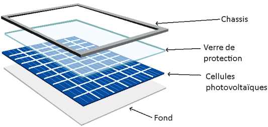
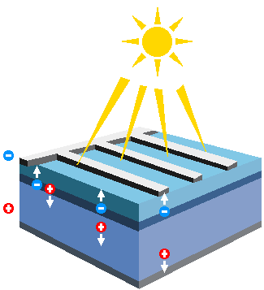
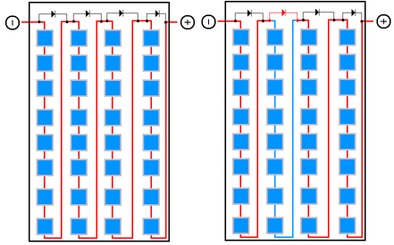
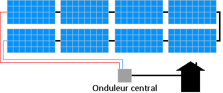
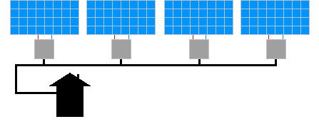

= Comment la production solaire fonctionne ?
:showtitle:
:page-title: Comment la production solaire fonctionne ?
:page-description: Explication simple du fonctionnement de la création d'électricité à partir du soleil
:page-layout: page

Dans ce chapitre, nous aborderons les principes de fonctionnement de la production solaire.

Pour des raisons de lisibilités, nous resterons très généralistes.

== Fonctionnement des panneaux solaires

Les panneaux solaires sont constitués de deux matériaux différents.
Les caractéristiques font que lorsque la lumière (pour comprendre correctement ce phénomène, la chaîne Youtube ScienceEtonnant, y consacre un
excellent épisode **Les photons existent-ils ?** : https://www.youtube.com/watch?v=mfhfSRjzlvc) vient _frapper_ le panneaux solaire,
il y a de l'électricité produite.
On peut imaginer que la lumière est une sorte de pierre qui est lancée sur le panneau solaire.
Plus la pierre (la lumière) frappe le panneau solaire à angle droit, plus la force de l'impact est fort et plus de d'électricité est produite.
C'est ce qu'on nomme l'orientation du panneau solaire.

Cette électricité en sortie du panneau solaire est trop faible pour être utilisée dans une maison et présente une caractéristique qui la rend incompatible avec les appareils branchés sur les prises électriques de la maison.

Pour rendre cette électricité utilisable, il faut utiliser un appareil appelé onduleur.

La puissance des panneaux est exprimée en Watt-crête (Wc), c'est la puissance maximale du panneau dans les conditions idéales.
Cette puissance crête doit être lue en Watt-crête par heure.
Ainsi, un panneau solaire de 400Wc, produit au maximum, 400W par heure.
Cette notion de Watt-crête (Wc) est aussi utilisée pour décrire une installation photovoltaïque.
Gardez toutefois à l'esprit que ces valeurs sont obtenues en laboratoire et qu'il est peu probable que vos panneaux produisent autant.

Le type de cellule a aussi sont importance.
Actuellement, les panneaux monocristallins sont les plus performantes.

=== Diodes by pass

Un panneau solaire est en fait composé de deux demi-panneaux, eux même composé de plusieurs cellules photovoltaïques.

Chaque cellule produit très peu d'électricité.
Pour des raisons _pratiques_, les cellules sont mises en série.

L'inconvénient, c'est qu'avec ce système, si une seule cellule est en panne, la panneau entier s'arrête de fonctionner.

Si une cellule a de l'ombre sur elle, la production baisse.
Sans rentrer dans le détail, si on imagine les cellules photovoltaïques sont des piles de 9V, cela signifie que
les cellules bien exposées produisent 9V et la cellule ombragée produit 1.5V.

En électricité, c'est la tension (9V) qui va _s'imposer_.
Cela signifie que la pile 1.5V va se retrouver un peu dans la situation d'une pile en train d'être rechargée.

Dans la mesure où les cellules photovoltaïques ne sont pas faites pour être rechargées, les cellules vont s'échauffer et il y a un risque d'incendie.

Pour éviter ce phénomène, un composant appelé diode bypass est installé.
Son but, est de court-circuiter la cellule (représentée dans l'exemple précédent par la pile 1.5V) et faire comme s'il n'y avait pas de cellule.

Pour optimiser le rendement solaire, d'autres diodes bypass sont installées.

Dans l'image suivante, à gauche, un panneau solaire sans ombrage, à droite, un panneau solaire ombragé.
La diode de bypass en rouge permet de court-circuiter une partie du panneau solaire.

== Onduleur central et micro-onduleur

Les onduleurs centraux et micro-onduleurs sont chargés de transformer l'électricité dite continue qui sort du panneau solaire en électricité dite alternative.

Jusqu'en 2008, la solution consistait à connecter les panneaux les uns aux autres afin d'avoir une électricité élevée et de brancher le tout à un seul onduleur (onduleur central).
Cet onduleur injectait l'électricité convertie sur le réseau de la maison.

Ce type d'installation est plus sensible à l'ombrage.
Toutefois, attention à ceux qui exagèrent en disant que si un panneau solaire est à moitié ombragé, alors toute la production est divisée par deux.
C'est plus compliqué que cela.

A partir de 2008, une autre solution est apparue consistant à mettre un petit onduleur, qu'on appelle micro-onduleur, à chaque panneaux solaires et ce sont ces micro-onduleurs qui sont reliés les un aux autres.

Avec ces micro-onduleurs, on peut installer une passerelle qui permet de contrôler l'état des micro-onduleurs, leurs productions...
Ces passerelles sont optionnelles et suivant la taille de l'installation, cela permet de gagner quelques centaines d'euros si on s'abstient de l'installer.

Quels sont les avantages et inconvénients de chaque solution ?

Et bien, les fabricants d'onduleurs centraux vous diront que c'est leur solution qui est le mieux, les fabricants de micro-onduleur vont vous dire que c'est leur solution la meilleure.

A ce stade, il vaut mieux laisser ce sujet de côté.
Il sera abordé dans la section correspondante dans le chapitre **Réaliser soi-même une installation**.
