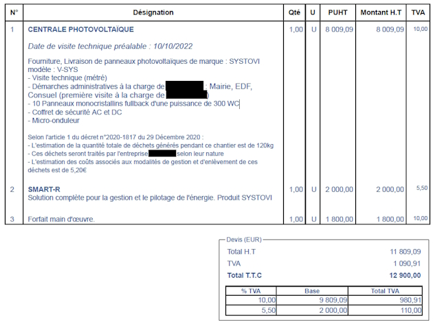
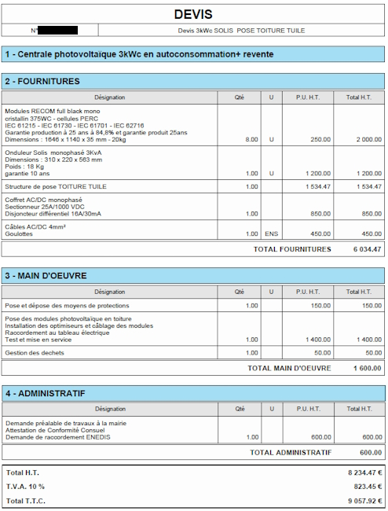

= Mon installation solaire par un professionnel
ifndef::book[]
:showtitle:
:page-title: Mon installation solaire par un professionnel
:page-description: Quand passez par un professionnel et que regarder ?
:page-layout: page
endif::[]

== Se faire accompagner

=== France Renov'

La plateforme https://france-renov.gouv.fr[France Renov'] a pour but d'informer, guider et orienter les ménages souhaitant réaliser des travaux de rénovation énergétique de leur logement.

Lorsque vous prenez rendez-vous, vous serez reçu non pas par un agent public mais par un membre d'une association.

A vous de vérifier que l'association a bien les mêmes valeurs que vous.

=== Associations de consommateurs

Il existe en France de nombreuses associations de consommateurs.

Elles ont pour ligne directrice de défendre le consommateur dans le respect des lois. Certaines sont très connues et réputées pour leur impartialité.

Vous pouvez leur faire confiance pour vous guider au mieux sur le choix d'un devis d'installation photovoltaïque.

Afin de connaitre les associations de consommateur, vous pouvez vous rendre sur le site du gouvernement https://www.economie.gouv.fr/dgccrf ou sur le site https://www.inc-conso.fr/.

== Aide de l'Etat

Afin de connaître les aides de l'état, le plus sûr est d'aller consulter le site du gouvernement
https://www.economie.gouv.fr/particuliers/aides-installation-photovoltaiques.
Vous pouvez aussi demander aux associations de consommateurs citées précédemment, vous éviterez des arnaques.

Il y a donc des aides en fonction de la puissance de votre installation photovoltaïque et de vos revenus.
Un taux de TVA à 10 % pour une installation inférieure ou égale à 3 kWc.

== Revente du surplus de production

Suivant votre projet et votre installation photovoltaïque, il est est possible que par moment, votre installation produise plus que votre consommation.
Votre projet pourrait être aussi de revendre toute l'électricité produite.

Le matériel et le temps d'installation ont un coût. Il faut trouver le bon équilibre entre le dimensionnement et l'amortissement.

Suivant à qui vous revendrez l'électricité en surplus, cela impacte le choix de l'entreprise.
En effet, en France, il y a la possibilité de revendre l'électricité à EDF via une offre réglementée, appelée *Offre d'Achat* (OA), à la condition que l'entreprise qui réalise l'installation photovoltaïque soit certifiée RGE.

Sinon, si l'entreprise n'est pas certifiée RGE, vous pourrez uniquement revendre l'électricité au prix de marché (souvent bas) à certains fournisseurs d'électricités.
Généralement, ces fournisseurs d'électricité imposent de prendre l'abonnement électrique pour votre maison chez eux.
Il faut donc bien calculer les coûts.

Dans le cadre, d'une installation pour un particulier qui vise l'autoconsommation, la revente d'électricité (OA ou au prix de marché) impose un surdimensionnement de l'installation photovoltaïque qui augmente fortement le délais de retour sur investissement.

En tant que particuler, vous pouvez réinjecter gratuitement jusqu'à 3kW sur le réseau.

== Consommation du surplus de production

Si vous souhaitez mettre en place une solution pour éviter l'injection du surplus en mettant un système qui par exemple chauffe le ballon d'eau chaude avec l'électricité en surplus, il existe peu de solutions.

Le fabricant d'onduleur réputé https://www.fronius.com/[Fronius] propose quelques solutions comme OhmPilot, mais les prix sont conséquents.

L'entreprise MyEnergi propose un système similaire moins cher appelé https://www.myenergi.com/nl/fr/product/eddi/[Eddi].
Il vous faudra comparer les deux produits afin de faire le bon choix.

Il existe d'autres solutions, qui seront abordées la section correspondante dans le chapitre *Réaliser soi même une installation*.
Dans la mesure, où vous faites le choix de passer par une entreprise, il est peu probable que d'autres solutions soient installées.

== Calcul de l'amortissement

Il est difficile de calculer l'amortissement d'une installation photovoltaïques.
Cela va dépendre de la production de votre installation, de votre consommation, du prix de l'installation, du prix de l'électricité...

Compter toutefois entre 7 et 10 ans pour amortir une installation réalisée par un professionnel.

== Lire un devis

=== Exemple devis 1

Voici le devis :

Il est fait mention de micro-onduleurs et d'un coffret de sécurité AC et DC.
Il n'y pas besoin de coffret DC avec les micro-onduleurs.
Est-ce juste une erreur de frappe ?

Le choix s'est porté sur des panneaux mono-crystalins c'est ce qu'il y a de mieux au niveau du rendement.
Les fullblacks sont certes plus jolis, mais plus cher.
La personne qui a fait le devis n'a pas posé la question de ce choix au client.
Dommage.

En prenant des panneaux de 420-450W, on aurait pû installer que 7 panneaux.
Gain de temps de mise en œuvre, gain de matériel à installer, donc gain d'argent.
On aurait pû en plus économiser 3 micros-onduleurs.
Le problème c'est que Systovi, à l'heure de l'écriture de ces lignes en 2024, ne fait pas pour l'instant des panneaux de plus de 330W.

Les micro-onduleurs installés sont des micro-onduleurs de la marque AP Systems, une des trois grandes marques de micro-onduleurs.
Ils fonctionnent avec deux panneaux.
Il faudrait alors soit installer 8 panneaux, soit 6 panneaux.
Afin d'avoir le maximum d'aide de la part de l'État, il est nécessaire que l'installation photovoltaïque soit de 3kWc maximum.
Dans le cas, présent, il faudrait donc installer que 6 panneaux.

Pour ce qui est de la solution Smart-R de Systovi, dans le cas où il n'y a pas de batterie, j'ai l'impression que c'est l'ECU-C d'AP Systems qui est vendu environ 300€.

=== Exemple devis 2

Voici le devis :

L'installateur a choisi un onduleur central Solis.
Solis est un marque chinoise correcte qui coûte environ 600€ (en 2024) pour 3kWc.
Pour 1200€, on aurait pu avoir un Fronius ou SMA qui est dans le top niveau qualité et SAV.

Comme pour le premier devis, des panneaux plus puissants et moins nombreux aurait pu être installés, réduisant le matériel et la main d'œuvre, donc le prix.

Les panneaux fullblack sont plus cher, il y a moyen de gagner un peu sur cette partie.

Sinon, le reste est tout à fait correct.

== Pièges à éviter

Le solaire peut-être très intéressant.
Mais attention aux belles promesses auxquelles il est facile de céder.

Il vaut mieux éviter de signer un devis dans une foire ou un salon, la vente est ferme et définitive, le droit de rétractation inexistant !

Comme toujours, attention aux démarchages.
Abstenez-vous de toute signature aussi bien au téléphone que directement à domicile.
Laisser le démarcheur sur le pas de la porte et prenez ses coordonnées, puis vérifier la crédibilité de l'entreprise.
Les associations de consommateurs sont souvent très bien renseignées sur ce type d'entreprise et pourront vous éviter des déconvenues.

Avec les exemples de devis, nous avons pu constater de grands écarts de prix.
Prenez le temps de vous renseigner (ne cédez pas aux promos qui se terminent dans la journée).
Les associations de consommation conseillent des professionnels RGE QualiPV et RGE Qualifelec.
Toutefois, il existe des installeurs très sérieux sans ces qualifications (qualifications qui font généralement augmenter le prix du devis car cela ajoute des démarches à l'entreprise, mais qui normalement assure un certain sérieux).
Dans tous les cas, prenez un installateur local car en cas de problème, une entreprise siégeant à 100Km du point d'installation sera toujours très peu motivée pour intervenir.

Avant de signer le devis, vous pouvez demander l'avis sur des forums comme celui cité en introduction de ce guide.
Vous pouvez aussi comparer le devis via la simulation sur le site https://evaluer-mon-devis.photovoltaique.info[ÉVALUER MON DEVIS PHOTOVOLTAIQUE.INFO]
conseillé par l'UFC Que Choisir.
