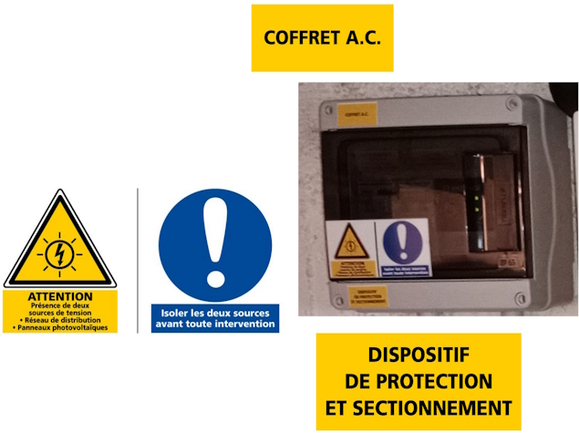

# Réaliser soi-même une installation

Avant de vous lancer dans la réalisation, il est important d'avoir des notions de bases.

Il est nécessaire de connaître quelques équations rencontrees en électricité :
* P=UxIxK : La puissance résulte de la multiplication de la tension et de l'intensité. La constance K dépend du contexte, elle vaut 1 en continue
* U=KxI : La tension a une relation de proportionnalité avec I. Si I varie, U varie. Si U varie, I varie.

## Normes

### NF C-15 100

La norme NF C-15 100 définit les règles de conception, de réalisation et d'entretien des installations électriques basse tension (400 ou 230 volts) en France.
C'est la norme à appliquer en France dans les habitations.

C'est cette norme qui impose par exemple la section des câbles suivant l'usage et la puissance, le disjoncteur associé....

Il est important de connaitre cette norme et surtout la comprendre.
La norme fait plus de 500 pages et couvre de très nombreux aspects.

Suivant le type d'installation, plus au moins de connaissances de cette norme seront nécessaires.

### UTE C-15 712

L'UTE C-15 712 est une précision de la norme NF C-15 100 pour les installations photovoltaïque.

L'Union technique de l'électricité (UTE) était chargée des normes électriques de 1907 à 2019 avant de fusionner avec l'AFNOR.

## Rappel des bases électriques

### Qu'est-ce que l'électricité ?

La question peut sembler évidente, mais qu'est-ce que l'électricité ?
Comment la fabrique-t-on ?

Tout d'abord, il faut rappeler que l'électricité c'est le déplacement d'électrons.
Les électrons sont des éléments qui constituent un atome.

Peut-être avez-vous déjà entendu que les atomes sont composés [d'électrons, de protons et de neutrons](https://www.irsn.fr/savoir-comprendre/dialogue-pedagogie/atome-cest-quoi).
Voici une représentation répandue :


_Feustan, CC BY-SA 3.0, via Wikimedia Commons_

Comme on peut le voir, il y a un noyau composé de proton et neutron, autour, gravitent des électrons.

On a attribué une valeur mathématique négative aux électrons et positive aux protons.
Cette valeur est arbitraire mais cela permet de faire des calculs mathématiques.

Mais au fait, pourquoi c'est un déplacement d'électrons pour l'électricité et non un déplacement de protons ?

Déplacer un proton nécessite de faire une fission nucléaire, c'est ce qui est mis en œuvre dans les centrales nucléaires pour produire de l'électricité.
Une opération compliquée et nécessitant d'important moyen.

On peut, pour faciliter la compréhension, dire que le cœur d'un atome peut être vu comme une planète et les électrons comme des lunes.

Maintenant, comment déplacer une lune ?

Il faut savoir, que plus une lune est proche d'une planète, plus elle est attirée par cette planète, c'est la gravité.
Pour un électron, c'est un peu le même principe, plus il est proche du noyau, plus il est _attiré_ par le noyau, donc, plus la _gravité_ est forte.

Comme pour les planètes, avec les lunes, il faudra d'autant plus d'énergie pour _arracher_ le satellite à l'attraction terrestre.
On comprend donc qu'il est plus simple et plus _rentable_ de déplacer les électrons loin du noyau plutôt que les électrons proches ou même les protons.

La couche qui comporte les électrons les plus éloignés du noyau s'appelle couche de valence.
C'est dans cette couche que les électrons sont amenés à interagir avec les autres entités chimiques.
C'est aussi là qu'il et le plus facile et le moins coûteux en énergie de déplacer un électron.

Produire de l'électricité, c'est déplacer un électron d'un atome A de la couche de valence, vers la couche de valence d'un atome B.

Le nombre d'électrons dans la couche de valence va permettre de classer les matériaux en tant qu'isolant ou conducteur.

Une chose intéressante à savoir, c'est que lorsque un électron se déplace, il produit un champs magnétique perpendiculairement à sa direction.
Nous verrons plus loin que ce phénomène est extrêmement intéressant.

Comment alors déplace-t-on des électrons ?
I l existe différents moyens pour cela :
* pour fabriquer des piles, c'est un procédé chimique.
* pour les centrales hydro-électriques c'est un procédé magnétique.
* pour le solaire, c'est un photon qui vient percuter un électron et qui le faire _sauter_ d'un atome à un autre et produit ainsi du courant.

### Alternatif ou continu ?

Le courant continue voit ses électrons aller toujours dans le même sens.
Un peu à l'image d'un robinet d'eau.
L'eau coule toujours dans le même sens et si le réservoir vient à être vide, l'eau ne coule plus.


Le courant alternatif va dans un sens puis dans l'autre.
Si on reprend l'image de l'eau, cela signifie que l'eau sort du robinet puis rentre dans le robinet.
Il est donc impossible de remplir un verre d'eau.
L'eau ne se tarira jamais.
C'est le mouvement de l'eau qui lui peut s'arrêter.


### Le courant

En électricité le courant (ou intensité), s'exprime en Ampère (A).
Cela correspond à un flux d'électrons dans un conducteur (fil électrique).

### La tension

En électricité la tension (ou différence de potentiel), s'exprime en Volt (V).
Cela correspond à la différence d'électrons présent entre deux zones (ici deux fils).

### Est-ce la tension ou le courant qui est le plus dangereux ?

Pour essayer de visualiser concrètement ce à quoi cela pourrait correspondre à notre échelle, imaginez une personne B qui se positionne collée à une autre A.
Les deux personnes ont une grande surface en contact.
La personne B avance tout doucement.
En soi, cela ne pose aucun problème.

Maintenant, imaginez la personne B à un mètre de distance, qui envoie un coup de poing dans la figure de la personne A.
Là, il y a un problème.

La surface représente le flux d'électron (intensité).
Dans le premier cas, le flux d'électron est élevé mais sa vitesse est lente.
Il n'y a aucun danger.

Dans le deuxième cas, le flux d'électron est faible, la surface du poing.
Pourtant la vitesse est élevée (la différence de potentiel), les conséquences sont dangereuses.

Ce phénomène se produit dans l'espace où une poussière qui gravite à 36 000 Km/h peut faire un trou de plusieurs centimètres carrés dans un satellite.

### Tension de sécurité

La norme NF C-15 100 indique que la tension de contact en milieu sec ne doit pas dépasser 50V en alternatif (50Hz, car oui la fréquence aussi à son importance) et 75V en continu.

Sans rentrer dans le détail de ce calcul, il faut bien se rappeler que la tension et le courant sont liés.
La formule U (tension) = k (une constante) * I (intensité) nous permet de comprendre cette relation.

Les phénomènes provoqués par le passage du courant sont juste différents en alternatif ou continu.

Plus la tension est élevée, plus l'intensité pourra être forte, plus les dégâts seront importants dans un laps de temps très court.

Si on veut simplifier, le danger = Tension + Courant + Temps.

Exemple d'un tableau :


Zones de danger du courant électrique alternatif (50 Hz) en fonction de l’intensité (A) et du temps (s). © Cmglee, Wikipedia
* AC1 : non perceptible.
* AC2 : limite de perceptibilité.
* AC3 : contraction musculaire réversible.
* AC4 : risque de fibrillation cardiaque (courbe 1 : <5 %, courbe 2 : 5 %<50 %, courbe 3 : >50 %).

### Neutre, phase, terre

Si on regarde une prise électrique en France, on remarque qu'il y a un renfoncement, deux trous ronds et une tige qui sort.


La tige qui sort correspond à ce qu'on a l'habitude d'appeler la terre mais qui dans la norme NF C-15 100 s'appelle PE (Protection Équipotentielle).
Les deux autres sont soit la phase, soit le neutre.

Contrairement à ce qu'on peut souvent lire, la norme NF C-15 100 n'impose pas que la phase soit à droite...

Mais qu'est-ce que la phase, le neutre et la terre ?

Pour répondre à cette question, rendez-vous dans le section suivante.

### Produisons de l'électricité en toute sécurité

Nous allons parler de la production hydro-électrique.
Le principe de fonctionnement est le même avec de l'électricité produit par le nucléaire, le gaz, le fioul, le bois...

Comme évoqué avant, lorsqu'un électron se déplace, il produit un champs magnétique.
La nature a bien fait les choses, l'inverse est vrai.
Si on fait varier un champs magnétique, on déplace des électrons.

Comment faire varier un champs magnétique dans un conducteur ?

Un aimant bien sûr !

Construisons ensemble un générateur.
Nous allons fixer un aimant à un axe.
Dans le cas d'une centrale hydro-électrique, nous allons utiliser la chute de l'eau pour faire tourner l'aimant.

Autour, nous allons fixer trois conducteurs (prenons ce nombre pour acquis).
Pour produire plus d'électricité, nous allons enrouler sur lui même le conducteur.


Il faut donc en tout six câbles pour distribuer l'électricité.
C'est beaucoup et ça coûte cher.

Les trois bobines produisent du courant alternatif.
En effet, le pole nord de l'aimant passe devant une bobine, puis c'est le pole sud qui passe devant.
L'aimant _pousse_ les électrons, puis les _tire_.

Les trois bobines produissent du courant en décalées.
Cela signifie que si on superpose l'électricité des trois bobines, voici ce qu'on obtient :


_CC BY-SA 3.0, via Wikimedia Commons_

Chose intéressante (vous pourrez trouver la démonstration sur internet), la somme des trois courants s'annulent.

Cela signifie qu'il est possible de relier les trois bobines ensemble d'un côté, sans créer de court-circuit.


Les électrons circulent dans une des phases et reviennent par le neutre.
Grâce à ce système, de six conducteurs (câbles), nous passons à quatre conducteurs.
C'est gagné !

Et bien, malheureusement, il y a des détails gênants (nous allons en voir deux).
Le premier est ce qu'on appelle le potentiel flottant.

Que se passe-t-il si une personne vient à toucher une phase ou le neutre et la terre (celle sur laquelle on marche) ?


Souvenez-vous, le potentiel (la tension), c'est la différence d'électrons entre deux endroits.
Comment faire pour savoir le nombre d'électrons qu'il y a dans la terre par rapport à nos bobines ?

La valeur peut être faible ou assez élevé pour tuer la personne.

Deuxième problème, que se passe-t-il si pour une raison quelconque, une phase touche le sol ?

Si une personne touche le neutre, conducteur par principe non dangereux, elle peut se faire électrocuter ou électriser.

Puisque le neutre, n'a pas de courant qui circule en lui, relions le à la terre !
Ainsi, nous connaissons la valeur exacte lorsque la personne touchera une phase et la terre.
Il ne se passera rien quand la personne touchera le neutre et la terre.


A présent, nous sommes en capacité de détecter une fuite à la terre, c'est à dire du courant qui passe d'une phase directement à la terre, sans passer par le neutre.

Car le courant qui passe par une phase doit repasser par le neutre.
S'il y a une différence, c'est qu'il y a un problème.
Voilà à quoi sert les interrupteurs différentiels 30mA et le disjoncteur différentiel de branchement 500mA.

### Monophasé et triphasé

Qu'est-ce que le triphasé et le monophasé ?

Le monophasé, se comprend assez bien.
On prend une phase et un neutre.
C'est ce qu'il y a aujourd'hui dans la majorité des habitations.
La tension entre une phase et le neutre en France est de 230V.

Mais que ce passe-t-il entre deux phases ?

Puisque les bobines ne produisent pas en même temps, il y a une tension.
Cette tension est plus élevée, elle est de 400V.

L'intérêt d'avoir une alimentation en triphasé, c'est d'avoir une tension plus élevée, souvenez-vous, P=UxI.
Donc, avec une tension plus élevée, on peut avoir plus de puissance.

Mais, généralement, on réserve le triphasé pour des cas précis car, sans rentrer dans le détail, il est plus difficile de mettre en œuvre le triphasé dans une habitation.

## Étude de cas

Vous avez tout compris aux chapitres précédents ?
Alors vous avez certainement les connaissances nécessaires pour réaliser vous même une installation solaire.

Afin de faciliter la compréhension des divers étapes et démarches à effectuer pour installer soit même des panneaux solaires,
nous allons étudier un cas.

Le but du propriétaire est de réduire un peu sa facture électrique.
Il veut au moins effacer son talon de consommation, c'est à dire la consommation de la maison lorsqu'il n'y a personne.

### Étude du solaire et de sa direction

Voici la maison vue du ciel :


Via le site [Solar Topo](http://www.solartopo.com/orbite-solaire.htm) nous pouvons voir le parcours du soleil suivant la date, l'heure...


En regardant le soleil en fin de journée, on détermine l'endroit le plus approprié pour poser les panneaux solaires :


Dans le cas que nous étudions, il n'y a que deux endroits intéressants :

* la toiture exposée à droite,
* la toiture exposée au sud.

La toiture exposée au sud est la toiture exposée le plus longtemps.
La toiture exposée à droite est celle exposée en premier.

Si vous souhaitez mettre des panneaux solaires sur les deux toitures, il faudra prendre un onduleur central à deux entrées (deux MPPT).

Parce que la mise en place est plus simple avec des micro-onduleurs, nous choisirons cette technologie.

En 2024, les trois grandes marques de micro-onduleurs sont :

- Enphase (américain)
- AP Systems (chine)
- Hoymiles (chine)

La maison est équipée d'un ballon d'eau chaude électrique de 2000W.
Les propriétaires souhaitent aussi pouvoir chauffer le ballon d'eau chaude.
Avec le talon de consommation, cela fait un maximum à fournir de 2400W.

2400W, c'est que qu'il faudra en sortie des onduleurs.
Avec des onduleurs de 300W, cela fait 8 onduleurs et 8 panneaux.

Les documents techniques indiquent que la puissance de sortie des onduleurs doivent être à environ 80% de la puissance des panneaux solaires, ce qui fait 375W.
Nous allons choisir des panneaux de 400Wc.

Maintenant que nous savons le nombre de panneaux et de micro-onduleurs, nous allons pouvoir commencer à concevoir l'implantation.


### Remplir une demande préalable de travaux

Maintenant que nous savons où mettre les panneaux solaires (les rectangles noirs sur la photo précédente), nous pouvons remplir le déclaration préalable de travaux.
La mairie à 2 mois pour répondre.
Une fois la réponse positive reçue, il faudra afficher l'autorisation.
Le délai de recours est de deux mois à compter de l'affichage pour les personnes (voisins par exemple) et un mois supplémentaire pour l'administration.

Une fois la demande déposée en mairie, avec l'expiration des délais pour un éventuel recours, nous avons largement le temps de concevoir les détails de mise en œuvre.

Dans un premier temps, il faut vérifier sur le site [Atlas des patrimoines](http://atlas.patrimoines.culture.fr) que l'habitation n'est pas dans un secteur classé.


L'habitation est dans une zone classée.
Il est conseillé de se rapprocher des Architectes des Bâtiments de France pour avoir leurs conseils.

Dans notre cas, la localisation des panneaux solaires ne pose pas de problème.

Vous pouvez pour certaines villes remplir la demande par internet.
Il s'agit de la **Déclaration préalable pour une maison individuelle et/ou ses annexes - DPMI (Formulaire 13703*12)**.
Attention à bien vérifier que c'est encore ce formulaire.
En un an, il a déjà changé.

Notez bien qu'il faut deux exemplaires de la demande si vous la faites en papier.
Dans notre étude de cas, il faudra un exemplaire supplémentaire pour les Architectes des Bâtiments de France.

Gardez aussi à l'esprit que vous devez tout donner pour que le dossier soit instruit.
Imaginez que la personne qui reçoit le dossier soit dans une bulle étanche.


#### Annexe DP1

Grâce au site [du cadastre](https://cadastre.data.gouv.fr), nous pouvons afficher à l'échelle 1:2000 l'habitation dans son environnement avec le numéro de la parcelle et une rose des vents.


#### Annexe DP4


#### Annexe DP6

Pour cet annexe, il faudra prendre l'habitation en photo et faire un montage pour permettre de visualiser le rendu final, lorsque les panneaux solaires seront installés.

#### Annexe DP7

Pour cet annexe, il faut prendre l'habitation en photo à 2-3 mètres du terrain et faire un montage pour permettre de visualiser le rendu final, lorsque les panneaux solaires seront installés

#### Annexe DP8

Pour cette annexe, il faut prendre l'habitation en photo depuis un point éloigné, par exemple au bout de la rue et faire un montage pour permettre de visualiser le rendu final, lorsque les panneaux solaires seront installés

### Calcul de section et protection nécessaire

Maintenant que nous savons où installer nos panneaux solaires, il est nécessaire de déterminer la section de câble qu'il doit être utilisé entre le tableau électrique
et les panneaux solaires.

Cela se fait au moyen de la formule suivante :
```
NB_PHASE: Nombre de phase
P_S_ONDULEUR: Puissance maximum en sortie onduleur (VA)
PCT_PERTE: 1% (NF C-15 100 tolère 3% maximum)
DISTANCE: Distance en mètre entre le tableau de raccordement et les panneaux solaires

Résistivité_Cuivre: voir tableau

Intensité = P_S_ONDULEUR / (230 * NB_PHASE)
Section_par_conducteur = (DISTANCE * R_Résistivité_Cuivre * Intensité) / (PCT_PERTE * 230)
```

| Section    |    2.5 |      4 |      6 |     10 |     16 |     25 |     35 |     50 |     70 |
|------------|--------|--------|--------|--------|--------|--------|--------|--------|--------|
| Résistance | 0.0205 | 0.0204 | 0.0203 | 0.0191 | 0.0198 | 0.0199 | 0.0198 | 0.0197 | 0.0194 |


En triphasé, on prend directement la valeur Section_par_conducteur.

En monophasé, on prend la valeur Section_par_conducteur * 2.

Nous sommes en monophasé, avec 5 mètres de câble entre le tableau électrique et les panneaux solaires. Nous avons 6 panneaux solaires, donc 6 micro-onduleurs.
Cela nous donne :

```
NB_PHASE: 1
P_S_ONDULEUR: 325 * 6 (car 6 onduleurs)
PCT_PERTE: 1%
DISTANCE: 5

Intensité = 325*6 / (230 * 1) => 8.47
Section_par_conducteur = (5 * 0.0205 * 8.47) / (0.01 * 230)
```

La section par conducteur est de 0.37mm², que nous multiplions par 2. Toutefois, la NF C-15 100 impose une section minimum de 1.5mm².
Les onduleurs sont livrés avec des câbles de 2.5mm², nous allons garder cette section et mettre un disjoncteur de 10A.

Le câble allant vers les panneaux solaires doit aussi être protégé contre les fuites de courant. Pour cela, il faut installer un interrupteur différentiel 30mA.
Du fait que le courant circulant entre les panneaux solaires et le tableau soit alternatif et qu'il n'y a pas de consommation de courant à composante continue, un type AC est suffisant.

### Remplir la demande Consuel

Puisque vous réalisez vous même l'installation des panneaux photovoltaïque et que pour cela, il est nécessaire de modifier l'installation électrique de l'habitation, vous devez faire valider l'installation par le Consuel, seul organisme agréé par l'État pour cette tâche.

Cela vous sera facturé environ 200€ (en 2024).

Une fois l'installation photovoltaïque réalisée, rendez-vous sur le site du [Consuel](https://www.consuel.com), créez-vous un compte et demandez une attestation **Installation de production d’énergie électrique sans dispositif de stockage** (Attestation de Conformité _Bleue_ (CERFA n°15523*01))

Voici comment procéder.
Acheter d'abord une attestation bleue :


Remarquez en haut, vous avez le nombre d'attestation que vous avez acheté et de quel type.

Vous devrez indiquer où se situe votre chantier.
Indiquez vos coordonnées.

Il faudra ensuite fournir le schéma électrique de l'installation photovoltaïque ainsi que le dossier technique.
Dans notre cas d'étude, nous allons remplir le formulaire SC144C2-1 qui est spécifique à la pose de micro-onduleur.

Voici comment le remplir :


Il faut joindre à ce dossier, le schéma technique.
Voici un exemple :


J'ai pris un schéma pour des micro-onduleurs IQ8 de la marque Enphase.
Notez que les deux éléments : _Relay Q_ et _Passerelle Envoy_ sont propres à cette marque.
Il se peut que ces éléments ne soient pas présent dans votre installation.

Il faut aussi bien noter la présence du fil de terre qui relie le chassis des panneaux photovoltaïques ainsi que
les éléments métalliques (rails) sur lesquels les panneaux photovoltaïques sont posés.
Cet élément est obligatoire car la foudre pourrait toucher les panneaux ou la structure.
Il est aussi conseillé (ou obligatoire suivant le département où se trouve l'installation) de mettre un parafoudre (ici il est dans le tableau principal).

Sur le plan, les éléments liés à la production d'électricité sont mis dans un tableau électrique séparé. 
Vous pouvez les mettre dans le tableau principal mais il faudra qu'il y ait une séparation marquée.
Au prix du boîtier électrique, le plus simple est de le mettre à côté du tableau général si vous avez la place.

La longueur des liaisons est indiquée sur le schéma permettant ainsi à la personne qui l'étudie de constater que la section entre les panneaux
photovoltaïques par rapport à la puissance est bonne et que le tableau de production électrique est à moins de 3 mètres du tableau principal
et ne nécessite donc pas l'ajout d'un interrupteur différentiel dans le tableau électrique principal.

Il faudra aussi fournir l'attestation EN 50549 (VFR2019) des micro-onduleurs à télécharger sur le site du fabricant.


Une fois tout rempli, sur le site, voici l'écran à remplir :


#### Étiquetage

Disjoncteur de branchement (le 500mA) :


Dans le tableau général :


Dans le tableau de production électrique :



Notez le fait qu'il n'existe pas de planche d'autocolant pour les micro-onduleurs.
Vous devez utiliser les planches vendues pour les onduleurs centraux.

Le Consuel rapport que 36% des installations visitées en 2020 ont un défaut de signalisation !

### Remplir une demande CACSI (Convention d'Autoconsommation Sans Injection)

Une fois votre installation terminée et validée par le Consuel, il vous faut signer une convention avec Enedis (ou votre gestionnaire local).
Dans le cas d'Enedis, rendez-vous sur le [portail de raccordement](https://connect-racco.enedis.fr) et créez-vous un compte.


Indiquez le commune où se trouve l'habitation.


Ensuite complétez tous les éléments :


Maintenant renseignez l'installation :


**Puissance installée de production** : dans notre cas d'étude les panneaux solaires ont une puissance crête supérieure aux micro-onduleurs.
Dans ce cas, c'est la somme des puissances de sortie des onduleurs.
Dans le cas contraire, c'est la somme des puissances des panneaux photovoltaïques.

**Puissance crête** : somme des puissances crêtes des panneaux photovoltaïques.

**Surface totale des panneaux** : somme de la surface des panneaux photovoltaïques.
Vous aussi vous vous demandez à quoi ça peut bien leur servir ?

**Protection de découpage** : dans le cas des micro-onduleurs, il faut toujours cocher **Intégrée aux onduleurs conformes DIN VDE 0126-1-1** y compris pour Enphase qui a un module externe.

Enfin, joignez tous les documents nécessaires :


Par expérience, joignez tous les documents demandés.
Même si certains sont facultatifs, ils vous seront demandés par Enedis.

Dans la partie autres documents, joignez l'attestation EN 50549 (VFR2019) car sinon elle vous sera demandée par Enedis.
Vous vous dites que c'est étrange puisque cette attestation est obligatoire pour l'attestation Consuel.
Attestation Consuel qui est obligatoire pour faire la demande de CACSI...

## Consommation du surplus de production

Comme évoqué dans la section **Mon installation solaire par un professionnel**, d'autres entreprises proposent des produits qui permettent de consommer le surplus d'électricité.
Ces solutions sont moins chers que Fronius et MyEnergi.

Veillez à bien à vérifier la conformité de ce type de matériel avec la réglementation électrique (perturbation électrique...).

Des projets sur internet proposent de faire la même chose à un prix encore plus bas.
