* [Introduction](#Introduction)
  * [Où trouver la dernière version de ce document](#O%C3%B9%20trouver%20la%20derni%C3%A8re%20version%20de%20ce%20document)
  * [Licence](#Licence)
* [Points administratifs à connaître dans tous les cas](#Points%20administratifs%20%C3%A0%20conna%C3%AEtre%20dans%20tous%20les%20cas)
  * [Installation en surimposition](#Installation%20en%20surimposition)
  * [Avis des Architectes des Batiments de France (ABF)](#Avis%20des%20Architectes%20des%20Batiments%20de%20France%20(ABF))
  * [Déclaration préalable de travaux](#D%C3%A9claration%20pr%C3%A9alable%20de%20travaux)
* [CACSI: Convention d'Autoconsommation Sans Injection](#CACSI%3A%20Convention%20d'Autoconsommation%20Sans%20Injection)
* [Assurance](#Assurance)
* [Comment la production solaire fonctionne ?](#Comment%20la%20production%20solaire%20fonctionne%20%3F)
  * [Fonctionnement des panneaux solaires](#Fonctionnement%20des%20panneaux%20solaires)
    * [Diodes by pass](#Diodes%20by%20pass)
  * [Onduleur central et micro-onduleur](#Onduleur%20central%20et%20micro-onduleur)
* [Bien définir son projet](#Bien%20d%C3%A9finir%20son%20projet)
* [Mon installation solaire par un professionnel](#Mon%20installation%20solaire%20par%20un%20professionnel)
  * [Se faire accompagner](#Se%20faire%20accompagner)
    * [France Renov'](#France%20Renov')
    * [Associations de consommateurs](#Associations%20de%20consommateurs)
  * [Aide de l'Etat](#Aide%20de%20l'Etat)
  * [Revente du surplus de production](#Revente%20du%20surplus%20de%20production)
  * [Consommation du surplus de production](#Consommation%20du%20surplus%20de%20production)
  * [Calcul de l'amortissement](#Calcul%20de%20l'amortissement)
  * [Lire un devis](#Lire%20un%20devis)
    * [Exemple devis 1](#Exemple%20devis%201)
    * [Exemple devis 2](#Exemple%20devis%202)
  * [Pièges à éviter](#Pi%C3%A8ges%20%C3%A0%20%C3%A9viter)
* [Kit photovoltaïque à brancher](#Kit%20photovolta%C3%AFque%20%C3%A0%20brancher)
  * [Les inconvénients, faux, qu'on peut nous dire](#Les%20inconv%C3%A9nients%2C%20faux%2C%20qu'on%20peut%20nous%20dire)
    * [Production d'électricité limitée](#Production%20d'%C3%A9lectricit%C3%A9%20limit%C3%A9e)
    * [Certains facteurs font varier leur efficacité](#Certains%20facteurs%20font%20varier%20leur%20efficacit%C3%A9)
    * [Impossibilité de revendre le surplus d'électricité](#Impossibilit%C3%A9%20de%20revendre%20le%20surplus%20d'%C3%A9lectricit%C3%A9)
    * [Les risques de surcharge électrique](#Les%20risques%20de%20surcharge%20%C3%A9lectrique)
    * [Augmentation de la dépendance au réseau électrique](#Augmentation%20de%20la%20d%C3%A9pendance%20au%20r%C3%A9seau%20%C3%A9lectrique)
* [Réaliser soi-même une installation](#R%C3%A9aliser%20soi-m%C3%AAme%20une%20installation)
  * [Normes](#Normes)
    * [NF C-15 100](#NF%20C-15%20100)
    * [UTE C-15 712](#UTE%20C-15%20712)
  * [Rappel des bases électriques](#Rappel%20des%20bases%20%C3%A9lectriques)
    * [Qu'est-ce que l'électricité ?](#Qu'est-ce%20que%20l'%C3%A9lectricit%C3%A9%20%3F)
    * [Alternatif ou continu ?](#Alternatif%20ou%20continu%20%3F)
    * [Le courant](#Le%20courant)
    * [La tension](#La%20tension)
    * [Est-ce la tension ou le courant qui est le plus dangereux ?](#Est-ce%20la%20tension%20ou%20le%20courant%20qui%20est%20le%20plus%20dangereux%20%3F)
    * [Tension de sécurité](#Tension%20de%20s%C3%A9curit%C3%A9)
    * [Neutre, phase, terre](#Neutre%2C%20phase%2C%20terre)
    * [Produisons de l'électricité en toute sécurité](#Produisons%20de%20l'%C3%A9lectricit%C3%A9%20en%20toute%20s%C3%A9curit%C3%A9)
    * [Monophasé et triphasé](#Monophas%C3%A9%20et%20triphas%C3%A9)
  * [Étude de cas](#%C3%89tude%20de%20cas)
    * [Étude du solaire et de sa direction](#%C3%89tude%20du%20solaire%20et%20de%20sa%20direction)
    * [Remplir une demande préalable de travaux](#Remplir%20une%20demande%20pr%C3%A9alable%20de%20travaux)
      * [Annexe DP1](#Annexe%20DP1)
      * [Annexe DP4](#Annexe%20DP4)
      * [Annexe DP6](#Annexe%20DP6)
      * [Annexe DP7](#Annexe%20DP7)
      * [Annexe DP8](#Annexe%20DP8)
    * [Calcul de section et protection nécessaire](#Calcul%20de%20section%20et%20protection%20n%C3%A9cessaire)
    * [Remplir la demande Consuel](#Remplir%20la%20demande%20Consuel)
      * [Étiquetage](#%C3%89tiquetage)
    * [Remplir une demande CACSI (Convention d'Autoconsommation Sans Injection)](#Remplir%20une%20demande%20CACSI%20(Convention%20d'Autoconsommation%20Sans%20Injection))
  * [Consommation du surplus de production](#Consommation%20du%20surplus%20de%20production)
* [Entretenir ses panneaux-solaires](#Entretenir%20ses%20panneaux-solaires)

# Introduction<a name="Introduction"></a>

Lorsque j'ai voulu me lancer dans le photovoltaïque, je ne trouvais pas par quoi commencer.
J'ai eu la chance de rencontrer des gens qui avaient fait l'installation par eux même, toutefois, il me restait encore de nombreuses questions.

Par ce guide, j'ai voulu essayer de faire le guide que j'aurai aimé avoir à ce moment là. 
Un guide qui explique de façon générale comment fonctionne le photovoltaïque mais aussi de façon beaucoup plus poussée car j'aime comprendre comment fonctionnent les choses.

C'est un guide qui a pour but de donner quelques clefs ou directions pour lancer votre projet.
Il a fallu faire des choix tant pour faciliter les explications que pour amener le lecteur progressivement dans le sujet.

J'ai donc pris le parti d'orienter la présentation dans le cas d'un propriétaire de maison, dans une assez grande ville.
De ce fait, j'ai laissé de côté le système de batteries ainsi que le sujet de l'autonomie totale en électricité.
J'ai aussi fait le choix de présenter la solution la plus simple à mettre en œuvre, celle avec micro-onduleur car pour une première installation, il y a déjà beaucoup à apprendre et comprendre.

Aussi, après lecture de ce guide, il vous faudra certainement creuser le sujet sur des forums comme le [Forum photovoltaïque](https://forum-photovoltaique.fr).

## Où trouver la dernière version de ce document<a name="O%C3%B9%20trouver%20la%20derni%C3%A8re%20version%20de%20ce%20document"></a>

Vous pouvez télécharger la dernière version de ce document à l'adresse suivante https://github.com/emeric-martineau/guide-photovoltaique/releases

## Licence<a name="Licence"></a>

Ce document est licencié sous Attribution-NonCommercial-ShareAlike 4.0 International © 2024 by Emeric MARTINEAU.

Vous pouvez avoir une copie de cette licence sur http://creativecommons.org/licenses/by-nc-sa/4.0/.

Vous êtes autorisé à :

 * Partager — copier, distribuer et communiquer le matériel par tous moyens et sous tous formats
 * Adapter — remixer, transformer et créer à partir du matériel
 * L'Offrant ne peut retirer les autorisations concédées par la licence tant que vous appliquez les termes de cette licence.

Selon les conditions suivantes :

 * Attribution — Vous devez créditer l'œuvre, intégrer un lien vers la licence et indiquer si des modifications ont été effectuées à l'œuvre. Vous devez indiquer ces informations par tous les moyens raisonnables, sans toutefois suggérer que l'Offrant vous soutient ou soutient la façon dont vous avez utilisé son œuvre.
 * Pas d'Utilisation Commerciale — Vous n'êtes pas autorisé à faire un usage commercial de cette œuvre, tout ou partie du matériel la composant.
 * Partage dans les Mêmes Conditions — Dans le cas où vous effectuez un remix, que vous transformez, ou créez à partir du matériel composant l'œuvre originale, vous devez diffuser l'œuvre modifiée dans les même conditions, c'est à dire avec la même licence avec laquelle l'œuvre originale a été diffusée.
 * Pas de restrictions complémentaires — Vous n'êtes pas autorisé à appliquer des conditions légales ou des mesures techniques qui restreindraient légalement autrui à utiliser l'œuvre dans les conditions décrites par la licence.

# Points administratifs à connaître dans tous les cas<a name="Points%20administratifs%20%C3%A0%20conna%C3%AEtre%20dans%20tous%20les%20cas"></a>

## Installation en surimposition<a name="Installation%20en%20surimposition"></a>

A part quelques cas très précis (zones protégées...), la mairie ne peut s'opposer à l'installation de panneaux solaires en sur-imposition.
L'[Arrêté du 19 décembre 2014 relatif aux caractéristiques des systèmes de production d'énergie à partir de sources renouvelables mentionnés à l'article R. 111-50 du code de l'urbanisme](https://www.legifrance.gouv.fr/jorf/id/JORFTEXT000029954131) indique :

> Les autorisations d'urbanisme ne peuvent ainsi s'opposer à l'utilisation d'équipements qui favorisent
> la performance environnementale des constructions, notamment lorsqu'ils sont renouvelables ou qu'ils
> permettent d'éviter l'émission de gaz à effet de serre.

## Avis des Architectes des Batiments de France (ABF)<a name="Avis%20des%20Architectes%20des%20Batiments%20de%20France%20(ABF)"></a>

Si votre installation n'est pas directement visible depuis un monument historique (pas inter-visibilité) ou non visible en même temps (non-covisibilité), l'[avis des Archites des Batiments de France est facultatifs](https://www.senat.fr/questions/base/2023/qSEQ230305721.html).

Toutefois, il y a de grande chance pour que la mairie où se trouve le projet demande quand même l'avis des ABF.

## Déclaration préalable de travaux<a name="D%C3%A9claration%20pr%C3%A9alable%20de%20travaux"></a>

Attention à ce que vous lisez sur internet, aussi bien sur des sites d'information que sur les sites de revendeur ou fabricant.

Que vous les posiez ou fixiez sur le toit ou en face de votre habitation, il vous faudra faire une déclaration préalable de travaux car vous modifiez l'[aspect de l'habitation](https://www.ecologie.gouv.fr/faut-il-autorisation-durbanisme-poser-des-panneaux-solaires-sur-toit).

La **pose** consiste à mettre un panneau solaire et le lester avec du poids pour éviter son envole. Il est déplaçable sans outil.

La **fixation** consiste à mettre un panneau solaire avec des mécanismes qui le lie avec un bâti pour l'empêcher de s'envoler. Il faut des outils pour le déplacer.

Pour ce qui est de l'installation au sol vous pouvez consulter le **Code de l'urbanisme**, [Article R*421-2](https://www.legifrance.gouv.fr/codes/article_lc/LEGIARTI000034355439).

En synthèse.

Cas général :

* Inférieure à 3KW et hauteur inférieure à 1.80m: dispensée de formalité.
* Inférieure à 3KW et hauteur supérieure à 1.80m : déclaration préalable de travaux.
* Jusqu'à 1 000KW: déclaration préalable de travaux.

Zone protégé :

* Inférieure à 3kW: déclaration préalable de travaux.
* Supérieure à 3kW: permis de construire 

Même exonérés d'autorisation, vos panneaux solaires sont considérés comme de la surface taxable, et implique le paiement d'une taxe d'aménagement.

# CACSI: Convention d'Autoconsommation Sans Injection<a name="CACSI%3A%20Convention%20d'Autoconsommation%20Sans%20Injection"></a>

Cette convention est signée avec Enedis. Même s'il y a la notion **sans injection**, le **Code de l'énergie**, **Chapitre V : L'autoconsommation**, **Article L315-5** indique que dans le cadre d'une autoconsommation, il est possible de réinjecter gratuitement de l'énergie dans le réseau.

La limite de la réinjection est fixée par décret et est actuellement (2024) à 3kW.

# Assurance<a name="Assurance"></a>

Une installation photovoltaïque en autoconsommation ne nécessite rien de particuler.
Il est quand même conseillé de signaler l'installation à votre assurance.

Si votre installation photovoltaïque a un contrat de revente, il faudra vous renseigner auprès de l'entreprise qui effectue le rachat.
Certaines obligent à être assurée.

# Comment la production solaire fonctionne ?<a name="Comment%20la%20production%20solaire%20fonctionne%20%3F"></a>

Dans ce chapitre, nous aborderons les principes de fonctionnement de la production solaire.

Pour des raisons de lisibilités, nous resterons très généralistes.

## Fonctionnement des panneaux solaires<a name="Fonctionnement%20des%20panneaux%20solaires"></a>

Les panneaux solaires sont constitués de deux matériaux différents.
Les caractéristiques font que lorsque la lumière (pour comprendre correctement ce phénomène, la chaîne Youtube ScienceEtonnant, y consacre un
excellent épisode **Les photons existent-ils ?** : https://www.youtube.com/watch?v=mfhfSRjzlvc) vient _frapper_ le panneaux solaire,
il y a de l'électricité produite.
On peut imaginer que la lumière est une sorte de pierre qui est lancée sur le panneau solaire.
Plus la pierre (la lumière) frappe le panneau solaire à angle droit, plus la force de l'impact est fort et plus de d'électricité est produite.
C'est ce qu'on nomme l'orientation du panneau solaire.

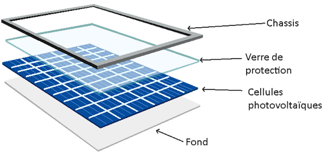

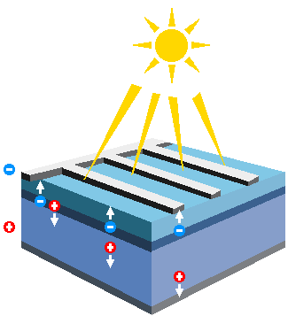

Cette électricité en sortie du panneau solaire est trop faible pour être utilisée dans une maison et présente une caractéristique qui la rend incompatible avec les appareils branchés sur les prises électriques de la maison.

Pour rendre cette électricité utilisable, il faut utiliser un appareil appelé onduleur.

La puissance des panneaux est exprimée en Watt-crête (Wc), c'est la puissance maximale du panneau dans les conditions idéales.
Cette puissance crête doit être lue en Watt-crête par heure.
Ainsi, un panneau solaire de 400Wc, produit au maximum, 400W par heure.
Cette notion de Watt-crête (Wc) est aussi utilisée pour décrire une installation photovoltaïque.
Gardez toutefois à l'esprit que ces valeurs sont obtenues en laboratoire et qu'il est peu probable que vos panneaux produisent autant.

Le type de cellule a aussi sont importance.
Actuellement, les panneaux monocristallins sont les plus performantes.

### Diodes by pass<a name="Diodes%20by%20pass"></a>

Un panneau solaire est en fait composé de deux demi-panneaux, eux même composé de plusieurs cellules photovoltaïques.

Chaque cellule produit très peu d'électricité.
Pour des raisons _pratiques_, les cellules sont mises en série.

L'inconvénient, c'est qu'avec ce système, si une seule cellule est en panne, la panneau entier s'arrête de fonctionner.

Si une cellule a de l'ombre sur elle, la production baisse.
Sans rentrer dans le détail, si on imagine les cellules photovoltaïques sont des piles de 9V, cela signifie que
les cellules bien exposées produisent 9V et la cellule ombragée produit 1.5V.

En électricité, c'est la tension (9V) qui va _s'imposer_.
Cela signifie que la pile 1.5V va se retrouver un peu dans la situation d'une pile en train d'être rechargée.

Dans la mesure où les cellules photovoltaïques ne sont pas faites pour être rechargées, les cellules vont s'échauffer et il y a un risque d'incendie.

Pour éviter ce phénomène, un composant appelé diode bypass est installé.
Son but, est de court-circuiter la cellule (représentée dans l'exemple précédent par la pile 1.5V) et faire comme s'il n'y avait pas de cellule.

Pour optimiser le rendement solaire, d'autres diodes bypass sont installées.

Dans l'image suivante, à gauche, un panneau solaire sans ombrage, à droite, un panneau solaire ombragé.
La diode de bypass en rouge permet de court-circuiter une partie du panneau solaire.


## Onduleur central et micro-onduleur<a name="Onduleur%20central%20et%20micro-onduleur"></a>

Les onduleurs centraux et micro-onduleurs sont chargés de transformer l'électricité dite continue qui sort du panneau solaire en électricité dite alternative.

Jusqu'en 2008, la solution consistait à connecter les panneaux les uns aux autres afin d'avoir une électricité élevée et de brancher le tout à un seul onduleur (onduleur central).
Cet onduleur injectait l'électricité convertie sur le réseau de la maison.

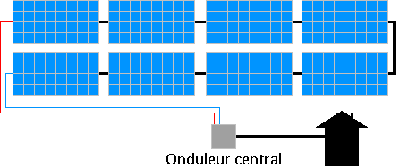

Ce type d'installation est plus sensible à l'ombrage.
Toutefois, attention à ceux qui exagèrent en disant que si un panneau solaire est à moitié ombragé, alors toute la production est divisée par deux.
C'est plus compliqué que cela.

A partir de 2008, une autre solution est apparue consistant à mettre un petit onduleur, qu'on appelle micro-onduleur, à chaque panneaux solaires et ce sont ces micro-onduleurs qui sont reliés les un aux autres.

Avec ces micro-onduleurs, on peut installer une passerelle qui permet de contrôler l'état des micro-onduleurs, leurs productions...
Ces passerelles sont optionnelles et suivant la taille de l'installation, cela permet de gagner quelques centaines d'euros si on s'abstient de l'installer.


Quels sont les avantages et inconvénients de chaque solution ?

Et bien, les fabricants d'onduleurs centraux vous diront que c'est leur solution qui est le mieux, les fabricants de micro-onduleur vont vous dire que c'est leur solution la meilleure.

A ce stade, il vaut mieux laisser ce sujet de côté.
Il sera abordé dans la section correspondante dans le chapitre **Réaliser soi-même une installation**.

# Bien définir son projet<a name="Bien%20d%C3%A9finir%20son%20projet"></a>

Il est très important de bien définir son projet.
En effet, le projet sera totalement différent aussi bien en terme de matériel que de démarche si vous souhaitez essayer la production solaire ou si vous voulez être autonome (et donc ne plus dépendre d'un fournisseur d'énergie).

Il faut aussi, savoir où seront installés les panneaux solaires.
Si vous voulez faire l'installation vous même cela va influencer le choix entre onduleur et micro-onduleur.
Dans tout les cas, cela va changer les démarches administratives.

Il est important de se souvenir que les panneaux produisent à un instant T.
Il faut donc consommer immédiatement l'électricité produite.

Cela signifie que lorsque vous ou une entreprise conçoit une installation, c'est la consommation instantanée qui va servir de base et non la consommation globale (annuelle, mensuelle).

Afin de bien visualiser votre consommation, je vous recommande d'activer le relevé par demi-heure auprès de votre distributeur.
Dans le cas d'Enedis, créez-vous un compte [sur leur site internet](https://www.enedis.fr) et activer l'option.

Gardez bien à l'esprit que les panneaux solaires produisent en journée. Il faudra donc décaler certains usages. Par exemple, lancer une machine de linge une journée de forte production.

Il est important de noter aussi, que si vous être en double tarification, ce qu'on appelle communément jour/nuit, il faudra changer pour une tarification unique car la 
double tarification devient inutilement plus cher lorsqu'on a des panneaux solaires.
Cela implique, si vous avez un ballon d'eau chaude électrique, de mettre une horloge pour éviter qu'il soit branché en permanence. Les ballons électriques ne sont pas conçu pour cela.

# Mon installation solaire par un professionnel<a name="Mon%20installation%20solaire%20par%20un%20professionnel"></a>

## Se faire accompagner<a name="Se%20faire%20accompagner"></a>

### France Renov'<a name="France%20Renov'"></a>

La plateforme [France Renov'](https://france-renov.gouv.fr) a pour but d'informer, guider et orienter les ménages souhaitant réaliser des travaux de rénovation énergétique de leur logement.

Lorsque vous prenez rendez-vous, vous serez reçu non pas par un agent public mais par un membre d'une association.

A vous de vérifier que l'association a bien les mêmes valeurs que vous.

### Associations de consommateurs<a name="Associations%20de%20consommateurs"></a>

Il existe en France de nombreuses associations de consommateurs.

Elles ont pour ligne directrice de défendre le consommateur dans le respect des lois. Certaines sont très connues et réputées pour leur impartialité.

Vous pouvez leur faire confiance pour vous guider au mieux sur le choix d'un devis d'installation photovoltaïque.

Afin de connaitre les associations de consommateur, vous pouvez vous rendre sur le site du gouvernement https://www.economie.gouv.fr/dgccrf ou sur le site https://www.inc-conso.fr/.

## Aide de l'Etat<a name="Aide%20de%20l'Etat"></a>

Afin de connaître les aides de l'état, le plus sûr est d'aller consulter le site du gouvernement
https://www.economie.gouv.fr/particuliers/aides-installation-photovoltaiques.
Vous pouvez aussi demander aux associations de consommateurs citées précédemment, vous éviterez des arnaques.

Il y a donc des aides en fonction de la puissance de votre installation photovoltaïque et de vos revenus.
Un taux de TVA à 10 % pour une installation inférieure ou égale à 3 kWc.

## Revente du surplus de production<a name="Revente%20du%20surplus%20de%20production"></a>

Suivant votre projet et votre installation photovoltaïque, il est est possible que par moment, votre installation produise plus que votre consommation.
Votre projet pourrait être aussi de revendre toute l'électricité produite.

Le matériel et le temps d'installation ont un coût. Il faut trouver le bon équilibre entre le dimensionnement et l'amortissement.

Suivant à qui vous revendrez l'électricité en surplus, cela impacte le choix de l'entreprise.
En effet, en France, il y a la possibilité de revendre l'électricité à EDF via une offre réglementée, appelée **Offre d'Achat** (OA), à la condition que l'entreprise qui réalise l'installation photovoltaïque soit certifiée RGE.

Sinon, si l'entreprise n'est pas certifiée RGE, vous pourrez uniquement revendre l'électricité au prix de marché (souvent bas) à certains fournisseurs d'électricités.
Généralement, ces fournisseurs d'électricité imposent de prendre l'abonnement électrique pour votre maison chez eux.
Il faut donc bien calculer les coûts.

Dans le cadre, d'une installation pour un particulier qui vise l'autoconsommation, la revente d'électricité (OA ou au prix de marché) impose un surdimensionnement de l'installation photovoltaïque qui augmente fortement le délais de retour sur investissement.

En tant que particuler, vous pouvez réinjecter gratuitement jusqu'à 3kW sur le réseau.

## Consommation du surplus de production<a name="Consommation%20du%20surplus%20de%20production"></a>

Si vous souhaitez mettre en place une solution pour éviter l'injection du surplus en mettant un système qui par exemple chauffe le ballon d'eau chaude avec l'électricité en surplus, il existe peu de solutions.

Le fabricant d'onduleur réputé [Fronius](https://www.fronius.com/) propose quelques solutions comme OhmPilot, mais les prix sont conséquents.

L'entreprise MyEnergi propose un système similaire moins cher appelé [Eddi](https://www.myenergi.com/nl/fr/product/eddi/).
Il vous faudra comparer les deux produits afin de faire le bon choix.

Il existe d'autres solutions, qui seront abordées la section correspondante dans le chapitre **Réaliser soi même une installation**.
Dans la mesure, où vous faites le choix de passer par une entreprise, il est peu probable que d'autres solutions soient installées.

## Calcul de l'amortissement<a name="Calcul%20de%20l'amortissement"></a>

Il est difficile de calculer l'amortissement d'une installation photovoltaïques.
Cela va dépendre de la production de votre installation, de votre consommation, du prix de l'installation, du prix de l'électricité...

Compter toutefois entre 7 et 10 ans pour amortir une installation réalisée par un professionnel.

## Lire un devis<a name="Lire%20un%20devis"></a>

### Exemple devis 1<a name="Exemple%20devis%201"></a>

Voici le devis :


Il est fait mention de micro-onduleurs et d'un coffret de sécurité AC et DC.
Il n'y pas besoin de coffret DC avec les micro-onduleurs.
Est-ce juste une erreur de frappe ?

Le choix s'est porté sur des panneaux mono-crystalins c'est ce qu'il y a de mieux au niveau du rendement.
Les fullblacks sont certes plus jolis, mais plus cher.
La personne qui a fait le devis n'a pas posé la question de ce choix au client.
Dommage.

En prenant des panneaux de 420-450W, on aurait pû installer que 7 panneaux.
Gain de temps de mise en œuvre, gain de matériel à installer, donc gain d'argent.
On aurait pû en plus économiser 3 micros-onduleurs.
Le problème c'est que Systovi, à l'heure de l'écriture de ces lignes en 2024, ne fait pas pour l'instant des panneaux de plus de 330W.

Les micro-onduleurs installés sont des micro-onduleurs de la marque AP Systems, une des trois grandes marques de micro-onduleurs.
Ils fonctionnent avec deux panneaux.
Il faudrait alors soit installer 8 panneaux, soit 6 panneaux.
Afin d'avoir le maximum d'aide de la part de l'État, il est nécessaire que l'installation photovoltaïque soit de 3kWc maximum.
Dans le cas, présent, il faudrait donc installer que 6 panneaux.

Pour ce qui est de la solution Smart-R de Systovi, dans le cas où il n'y a pas de batterie, j'ai l'impression que c'est l'ECU-C d'AP Systems qui est vendu environ 300€.

### Exemple devis 2<a name="Exemple%20devis%202"></a>

Voici le devis :


L'installateur a choisi un onduleur central Solis.
Solis est un marque chinoise correcte qui coûte environ 600€ (en 2024) pour 3kWc.
Pour 1200€, on aurait pu avoir un Fronius ou SMA qui est dans le top niveau qualité et SAV.

Comme pour le premier devis, des panneaux plus puissants et moins nombreux aurait pu être installés, réduisant le matériel et la main d'œuvre, donc le prix.

Les panneaux fullblack sont plus cher, il y a moyen de gagner un peu sur cette partie.

Sinon, le reste est tout à fait correct.

## Pièges à éviter<a name="Pi%C3%A8ges%20%C3%A0%20%C3%A9viter"></a>

Le solaire peut-être très intéressant.
Mais attention aux belles promesses auxquelles il est facile de céder.

Il vaut mieux éviter de signer un devis dans une foire ou un salon, la vente est ferme et définitive, le droit de rétractation inexistant !

Comme toujours, attention aux démarchages.
Abstenez-vous de toute signature aussi bien au téléphone que directement à domicile.
Laisser le démarcheur sur le pas de la porte et prenez ses coordonnées, puis vérifier la crédibilité de l'entreprise.
Les associations de consommateurs sont souvent très bien renseignées sur ce type d'entreprise et pourront vous éviter des déconvenues.

Avec les exemples de devis, nous avons pu constater de grands écarts de prix.
Prenez le temps de vous renseigner (ne cédez pas aux promos qui se terminent dans la journée).
Les associations de consommation conseillent des professionnels RGE QualiPV et RGE Qualifelec.
Toutefois, il existe des installeurs très sérieux sans ces qualifications (qualifications qui font généralement augmenter le prix du devis car cela ajoute des démarches à l'entreprise, mais qui normalement assure un certain sérieux).
Dans tous les cas, prenez un installateur local car en cas de problème, une entreprise siégeant à 100Km du point d'installation sera toujours très peu motivée pour intervenir.

Avant de signer le devis, vous pouvez demander l'avis sur des forums comme celui cité en introduction de ce guide.
Vous pouvez aussi comparer le devis via la simulation sur le site [ÉVALUER MON DEVIS PHOTOVOLTAIQUE.INFO](https://evaluer-mon-devis.photovoltaique.info)
conseillé par l'UFC Que Choisir.

# Kit photovoltaïque à brancher<a name="Kit%20photovolta%C3%AFque%20%C3%A0%20brancher"></a>

Les kits photovoltaïque ont l'avantage d'être simple à installer puisqu'ils sont simplement à brancher sur une prise électrique.

Le but de ces kits prêt à brancher est de permettre aux personnes de s'initier à l'énergie solaire et réduire un peu la facture d'électricité.

Comme vu dans la section [Points administratif à connaitre dans tous les cas](points-administratif-a-connaitre-dans-tous-les-cas.md), si vous posez au sol un kit solaire, la seule démarche à faire, est de créer un compte sur le site d'[Enedis Raccordement](https://connect-racco.enedis.fr) et de remplir la demande d'une CACSI.

Il faudra, bien sélectionner le fait que c'est un kit solaire et donc sans création de nouvelle ligne (passage du Consuel inutile, voir **Réaliser soi même une installation**).

## Les inconvénients, faux, qu'on peut nous dire<a name="Les%20inconv%C3%A9nients%2C%20faux%2C%20qu'on%20peut%20nous%20dire"></a>

Sur internet, des articles parlant des inconvénients des kits photovoltaïques peuvent être lus. Il est intéressant de voir que certains articles sont rédigés par des entreprises qui proposent la pose de système solaire. Est-ce dans l'intérêt de ces entreprises de vanter l'achat de ces kits prêt à l'emploi ?

Voici 3 articles que l'on peut lire sur internet :

* [Les inconvénients des panneaux solaires Plug & Play que les vendeurs oublient souvent de mentionner](https://www.neozone.org/innovation/les-inconvenients-des-panneaux-solaires-plug-play-que-les-vendeurs-oublient-souvent-de-mentionner/), 
* [Avantages et inconvénients des panneaux solaires plug and play](https://o2toit.fr/nos-actualites/solaire/panneaux-solaires-plug-and-play-une-fausse-bonne-idee/)
* [Pourquoi les inconvénients des panneaux photovoltaïques Plug and Play doivent-ils être pris au sérieux ?](https://www.solairepro.comparateur-panneau-solaire.fr/pourquoi-les-inconvenients-des-panneaux-photovoltaiques-plug-and-play-doivent-ils-etre-pris-au-serieux/)

Basons-nous sur ces articles afin de faire le point et de constater qu'on peut y trouver des idées aussi originales que surprenantes.

### Production d'électricité limitée<a name="Production%20d'%C3%A9lectricit%C3%A9%20limit%C3%A9e"></a>

Voilà un inconvénient qui n'a factuellement aucun sens.

Les kits sont des petites installations, leur but n'est pas de couvrir 100% des besoins électrique d'un foyer.

### Certains facteurs font varier leur efficacité<a name="Certains%20facteurs%20font%20varier%20leur%20efficacit%C3%A9"></a>

Exactement comme toutes installations solaires, même réalisées par un professionnel.

### Impossibilité de revendre le surplus d'électricité<a name="Impossibilit%C3%A9%20de%20revendre%20le%20surplus%20d'%C3%A9lectricit%C3%A9"></a>

Le but des kits solaires à installer soit même n'est en aucun cas de revendre l'électricité. Alors pourquoi en faire un inconvénient ?

### Les risques de surcharge électrique<a name="Les%20risques%20de%20surcharge%20%C3%A9lectrique"></a>

Voici un nouveau concept :
```
ils vont quand même être branchés sur votre compteur, qui doit respecter certaines normes.
En le branchant vous-même, sauf si vous êtes électricien, vous risquez de provoquer un
court-circuit, ou une surcharge qui ferait disjoncter votre compteur.
```

En France, nous avons la chance d'avoir l'une des meilleurs normes électrique au monde.

Tout appareil électrique doit respecter cette norme pour être vendu en France. Sauf à acheter un produit contrefait ou à un appareil défectueux, il n'y a aucun risque.

Parler de court-circuit ou de surcharge est au mieux une ignorance de comment fonctionne les panneaux solaires (et la norme qu'ils doivent respecter en France).

Alors quand on lit cela sur un site d'une entreprise professionnelle dans le photovoltaïque...

### Augmentation de la dépendance au réseau électrique<a name="Augmentation%20de%20la%20d%C3%A9pendance%20au%20r%C3%A9seau%20%C3%A9lectrique"></a>

On peut lire l'argument suivant :

```
Avec une puissance limitée, les utilisateurs des panneaux photovoltaïques
Plug and Play pourraient être davantage dépendants du réseau électrique
traditionnel.
```

Il est impossible qu'en produisant de l'électricité, on augmente sa dépendance au réseau électrique.


# Réaliser soi-même une installation<a name="R%C3%A9aliser%20soi-m%C3%AAme%20une%20installation"></a>

Avant de vous lancer dans la réalisation, il est important d'avoir des notions de bases.

Il est nécessaire de connaître quelques équations rencontrees en électricité :

* P=UxIxK : La puissance résulte de la multiplication de la tension et de l'intensité. La constance K dépend du contexte, elle vaut 1 en continue
* U=KxI : La tension a une relation de proportionnalité avec I. Si I varie, U varie. Si U varie, I varie.

## Normes<a name="Normes"></a>

### NF C-15 100<a name="NF%20C-15%20100"></a>

La norme NF C-15 100 définit les règles de conception, de réalisation et d'entretien des installations électriques basse tension (400 ou 230 volts) en France.
C'est la norme à appliquer en France dans les habitations.

C'est cette norme qui impose par exemple la section des câbles suivant l'usage et la puissance, le disjoncteur associé....

Il est important de connaitre cette norme et surtout la comprendre.
La norme fait plus de 500 pages et couvre de très nombreux aspects.

Suivant le type d'installation, plus au moins de connaissances de cette norme seront nécessaires.

### UTE C-15 712<a name="UTE%20C-15%20712"></a>

L'UTE C-15 712 est une précision de la norme NF C-15 100 pour les installations photovoltaïque.

L'Union technique de l'électricité (UTE) était chargée des normes électriques de 1907 à 2019 avant de fusionner avec l'AFNOR.

## Rappel des bases électriques<a name="Rappel%20des%20bases%20%C3%A9lectriques"></a>

### Qu'est-ce que l'électricité ?<a name="Qu'est-ce%20que%20l'%C3%A9lectricit%C3%A9%20%3F"></a>

La question peut sembler évidente, mais qu'est-ce que l'électricité ?
Comment la fabrique-t-on ?

Tout d'abord, il faut rappeler que l'électricité c'est le déplacement d'électrons.
Les électrons sont des éléments qui constituent un atome.

Peut-être avez-vous déjà entendu que les atomes sont composés [d'électrons, de protons et de neutrons](https://www.irsn.fr/savoir-comprendre/dialogue-pedagogie/atome-cest-quoi).
Voici une représentation répandue :


_Feustan, CC BY-SA 3.0, via Wikimedia Commons_

Comme on peut le voir, il y a un noyau composé de proton et neutron, autour, gravitent des électrons.

On a attribué une valeur mathématique négative aux électrons et positive aux protons.
Cette valeur est arbitraire mais cela permet de faire des calculs mathématiques.

Mais au fait, pourquoi c'est un déplacement d'électrons pour l'électricité et non un déplacement de protons ?

Déplacer un proton nécessite de faire une fission nucléaire, c'est ce qui est mis en œuvre dans les centrales nucléaires pour produire de l'électricité.
Une opération compliquée et nécessitant d'important moyen.

On peut, pour faciliter la compréhension, dire que le cœur d'un atome peut être vu comme une planète et les électrons comme des lunes.

Maintenant, comment déplacer une lune ?

Il faut savoir, que plus une lune est proche d'une planète, plus elle est attirée par cette planète, c'est la gravité.
Pour un électron, c'est un peu le même principe, plus il est proche du noyau, plus il est _attiré_ par le noyau, donc, plus la _gravité_ est forte.

Comme pour les planètes, avec les lunes, il faudra d'autant plus d'énergie pour _arracher_ le satellite à l'attraction terrestre.
On comprend donc qu'il est plus simple et plus _rentable_ de déplacer les électrons loin du noyau plutôt que les électrons proches ou même les protons.

La couche qui comporte les électrons les plus éloignés du noyau s'appelle couche de valence.
C'est dans cette couche que les électrons sont amenés à interagir avec les autres entités chimiques.
C'est aussi là qu'il et le plus facile et le moins coûteux en énergie de déplacer un électron.

Produire de l'électricité, c'est déplacer un électron d'un atome A de la couche de valence, vers la couche de valence d'un atome B.

Le nombre d'électrons dans la couche de valence va permettre de classer les matériaux en tant qu'isolant ou conducteur.

Une chose intéressante à savoir, c'est que lorsque un électron se déplace, il produit un champs magnétique perpendiculairement à sa direction.
Nous verrons plus loin que ce phénomène est extrêmement intéressant.

Comment alors déplace-t-on des électrons ?
Il existe différents moyens pour cela :

* pour fabriquer des piles, c'est un procédé chimique.
* pour les centrales hydro-électriques c'est un procédé magnétique.
* pour le solaire, c'est un photon qui vient percuter un électron et qui le faire _sauter_ d'un atome à un autre et produit ainsi du courant.

### Alternatif ou continu ?<a name="Alternatif%20ou%20continu%20%3F"></a>

Le courant continue voit ses électrons aller toujours dans le même sens.
Un peu à l'image d'un robinet d'eau.
L'eau coule toujours dans le même sens et si le réservoir vient à être vide, l'eau ne coule plus.


Le courant alternatif va dans un sens puis dans l'autre.
Si on reprend l'image de l'eau, cela signifie que l'eau sort du robinet puis rentre dans le robinet.
Il est donc impossible de remplir un verre d'eau.
L'eau ne se tarira jamais.
C'est le mouvement de l'eau qui lui peut s'arrêter.


### Le courant<a name="Le%20courant"></a>

En électricité le courant (ou intensité), s'exprime en Ampère (A).
Cela correspond à un flux d'électrons dans un conducteur (fil électrique).

### La tension<a name="La%20tension"></a>

En électricité la tension (ou différence de potentiel), s'exprime en Volt (V).
Cela correspond à la différence d'électrons présent entre deux zones (ici deux fils).

### Est-ce la tension ou le courant qui est le plus dangereux ?<a name="Est-ce%20la%20tension%20ou%20le%20courant%20qui%20est%20le%20plus%20dangereux%20%3F"></a>

Pour essayer de visualiser concrètement ce à quoi cela pourrait correspondre à notre échelle, imaginez une personne B qui se positionne collée à une autre A.
Les deux personnes ont une grande surface en contact.
La personne B avance tout doucement.
En soi, cela ne pose aucun problème.

Maintenant, imaginez la personne B à un mètre de distance, qui envoie un coup de poing dans la figure de la personne A.
Là, il y a un problème.

La surface représente le flux d'électron (intensité).
Dans le premier cas, le flux d'électron est élevé mais sa vitesse est lente.
Il n'y a aucun danger.

Dans le deuxième cas, le flux d'électron est faible, la surface du poing.
Pourtant la vitesse est élevée (la différence de potentiel), les conséquences sont dangereuses.

Ce phénomène se produit dans l'espace où une poussière qui gravite à 36 000 Km/h peut faire un trou de plusieurs centimètres carrés dans un satellite.

### Tension de sécurité<a name="Tension%20de%20s%C3%A9curit%C3%A9"></a>

La norme NF C-15 100 indique que la tension de contact en milieu sec ne doit pas dépasser 50V en alternatif (50Hz, car oui la fréquence aussi à son importance) et 75V en continu.

Sans rentrer dans le détail de ce calcul, il faut bien se rappeler que la tension et le courant sont liés.
La formule U (tension) = k (une constante) * I (intensité) nous permet de comprendre cette relation.

Les phénomènes provoqués par le passage du courant sont juste différents en alternatif ou continu.

Plus la tension est élevée, plus l'intensité pourra être forte, plus les dégâts seront importants dans un laps de temps très court.

Si on veut simplifier, le danger = Tension + Courant + Temps.

Exemple d'un tableau :


Zones de danger du courant électrique alternatif (50 Hz) en fonction de l’intensité (A) et du temps (s). © Cmglee, Wikipedia

* AC1 : non perceptible.
* AC2 : limite de perceptibilité.
* AC3 : contraction musculaire réversible.
* AC4 : risque de fibrillation cardiaque (courbe 1 : <5 %, courbe 2 : 5 %<50 %, courbe 3 : >50 %).

### Neutre, phase, terre<a name="Neutre%2C%20phase%2C%20terre"></a>

Si on regarde une prise électrique en France, on remarque qu'il y a un renfoncement, deux trous ronds et une tige qui sort.


La tige qui sort correspond à ce qu'on a l'habitude d'appeler la terre mais qui dans la norme NF C-15 100 s'appelle PE (Protection Équipotentielle).
Les deux autres sont soit la phase, soit le neutre.

Contrairement à ce qu'on peut souvent lire, la norme NF C-15 100 n'impose pas que la phase soit à droite...

Mais qu'est-ce que la phase, le neutre et la terre ?

Pour répondre à cette question, rendez-vous dans le section suivante.

### Produisons de l'électricité en toute sécurité<a name="Produisons%20de%20l'%C3%A9lectricit%C3%A9%20en%20toute%20s%C3%A9curit%C3%A9"></a>

Nous allons parler de la production hydro-électrique.
Le principe de fonctionnement est le même avec de l'électricité produit par le nucléaire, le gaz, le fioul, le bois...

Comme évoqué avant, lorsqu'un électron se déplace, il produit un champs magnétique.
La nature a bien fait les choses, l'inverse est vrai.
Si on fait varier un champs magnétique, on déplace des électrons.

Comment faire varier un champs magnétique dans un conducteur ?

Un aimant bien sûr !

Construisons ensemble un générateur.
Nous allons fixer un aimant à un axe.
Dans le cas d'une centrale hydro-électrique, nous allons utiliser la chute de l'eau pour faire tourner l'aimant.

Autour, nous allons fixer trois conducteurs (prenons ce nombre pour acquis).
Pour produire plus d'électricité, nous allons enrouler sur lui même le conducteur.


Il faut donc en tout six câbles pour distribuer l'électricité.
C'est beaucoup et ça coûte cher.

Les trois bobines produisent du courant alternatif.
En effet, le pole nord de l'aimant passe devant une bobine, puis c'est le pole sud qui passe devant.
L'aimant _pousse_ les électrons, puis les _tire_.

Les trois bobines produissent du courant en décalées.
Cela signifie que si on superpose l'électricité des trois bobines, voici ce qu'on obtient :


_CC BY-SA 3.0, via Wikimedia Commons_

Chose intéressante (vous pourrez trouver la démonstration sur internet), la somme des trois courants s'annulent.

Cela signifie qu'il est possible de relier les trois bobines ensemble d'un côté, sans créer de court-circuit.


Les électrons circulent dans une des phases et reviennent par le neutre.
Grâce à ce système, de six conducteurs (câbles), nous passons à quatre conducteurs.
C'est gagné !

Et bien, malheureusement, il y a des détails gênants (nous allons en voir deux).
Le premier est ce qu'on appelle le potentiel flottant.

Que se passe-t-il si une personne vient à toucher une phase ou le neutre et la terre (celle sur laquelle on marche) ?

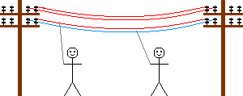

Souvenez-vous, le potentiel (la tension), c'est la différence d'électrons entre deux endroits.
Comment faire pour savoir le nombre d'électrons qu'il y a dans la terre par rapport à nos bobines ?

La valeur peut être faible ou assez élevé pour tuer la personne.

Deuxième problème, que se passe-t-il si pour une raison quelconque, une phase touche le sol ?

Si une personne touche le neutre, conducteur par principe non dangereux, elle peut se faire électrocuter ou électriser.

Puisque le neutre, n'a pas de courant qui circule en lui, relions le à la terre !
Ainsi, nous connaissons la valeur exacte lorsque la personne touchera une phase et la terre.
Il ne se passera rien quand la personne touchera le neutre et la terre.


A présent, nous sommes en capacité de détecter une fuite à la terre, c'est à dire du courant qui passe d'une phase directement à la terre, sans passer par le neutre.

Car le courant qui passe par une phase doit repasser par le neutre.
S'il y a une différence, c'est qu'il y a un problème.
Voilà à quoi sert les interrupteurs différentiels 30mA et le disjoncteur différentiel de branchement 500mA.

### Monophasé et triphasé<a name="Monophas%C3%A9%20et%20triphas%C3%A9"></a>

Qu'est-ce que le triphasé et le monophasé ?

Le monophasé, se comprend assez bien.
On prend une phase et un neutre.
C'est ce qu'il y a aujourd'hui dans la majorité des habitations.
La tension entre une phase et le neutre en France est de 230V.

Mais que ce passe-t-il entre deux phases ?

Puisque les bobines ne produisent pas en même temps, il y a une tension.
Cette tension est plus élevée, elle est de 400V.

L'intérêt d'avoir une alimentation en triphasé, c'est d'avoir une tension plus élevée, souvenez-vous, P=UxI.
Donc, avec une tension plus élevée, on peut avoir plus de puissance.

Mais, généralement, on réserve le triphasé pour des cas précis car, sans rentrer dans le détail, il est plus difficile de mettre en œuvre le triphasé dans une habitation.

## Étude de cas<a name="%C3%89tude%20de%20cas"></a>

Vous avez tout compris aux chapitres précédents ?
Alors vous avez certainement les connaissances nécessaires pour réaliser vous même une installation solaire.

Afin de faciliter la compréhension des divers étapes et démarches à effectuer pour installer soit même des panneaux solaires,
nous allons étudier un cas.

Le but du propriétaire est de réduire un peu sa facture électrique.
Il veut au moins effacer son talon de consommation, c'est à dire la consommation de la maison lorsqu'il n'y a personne.

### Étude du solaire et de sa direction<a name="%C3%89tude%20du%20solaire%20et%20de%20sa%20direction"></a>

Voici la maison vue du ciel :


Via le site [Solar Topo](http://www.solartopo.com/orbite-solaire.htm) nous pouvons voir le parcours du soleil suivant la date, l'heure...


En regardant le soleil en fin de journée, on détermine l'endroit le plus approprié pour poser les panneaux solaires :

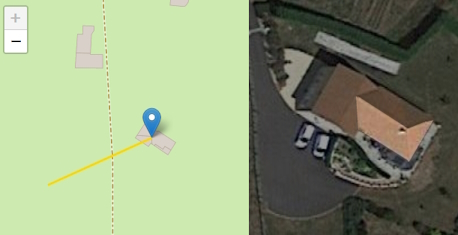

Dans le cas que nous étudions, il n'y a que deux endroits intéressants :

* la toiture exposée à droite,
* la toiture exposée au sud.

La toiture exposée au sud est la toiture exposée le plus longtemps.
La toiture exposée à droite est celle exposée en premier.

Si vous souhaitez mettre des panneaux solaires sur les deux toitures, il faudra prendre un onduleur central à deux entrées (deux MPPT).

Parce que la mise en place est plus simple avec des micro-onduleurs, nous choisirons cette technologie.

En 2024, les trois grandes marques de micro-onduleurs sont :

- Enphase (américain)
- AP Systems (chine)
- Hoymiles (chine)

La maison est équipée d'un ballon d'eau chaude électrique de 2000W.
Les propriétaires souhaitent aussi pouvoir chauffer le ballon d'eau chaude.
Avec le talon de consommation, cela fait un maximum à fournir de 2400W.

2400W, c'est que qu'il faudra en sortie des onduleurs.
Avec des onduleurs de 300W, cela fait 8 onduleurs et 8 panneaux.

Les documents techniques indiquent que la puissance de sortie des onduleurs doivent être à environ 80% de la puissance des panneaux solaires, ce qui fait 375W.
Nous allons choisir des panneaux de 400Wc.

Maintenant que nous savons le nombre de panneaux et de micro-onduleurs, nous allons pouvoir commencer à concevoir l'implantation.


### Remplir une demande préalable de travaux<a name="Remplir%20une%20demande%20pr%C3%A9alable%20de%20travaux"></a>

Maintenant que nous savons où mettre les panneaux solaires (les rectangles noirs sur la photo précédente), nous pouvons remplir le déclaration préalable de travaux.
La mairie à 2 mois pour répondre.
Une fois la réponse positive reçue, il faudra afficher l'autorisation.
Le délai de recours est de deux mois à compter de l'affichage pour les personnes (voisins par exemple) et un mois supplémentaire pour l'administration.

Une fois la demande déposée en mairie, avec l'expiration des délais pour un éventuel recours, nous avons largement le temps de concevoir les détails de mise en œuvre.

Dans un premier temps, il faut vérifier sur le site [Atlas des patrimoines](http://atlas.patrimoines.culture.fr) que l'habitation n'est pas dans un secteur classé.


L'habitation est dans une zone classée.
Il est conseillé de se rapprocher des Architectes des Bâtiments de France pour avoir leurs conseils.

Dans notre cas, la localisation des panneaux solaires ne pose pas de problème.

Vous pouvez pour certaines villes remplir la demande par internet.
Il s'agit de la **Déclaration préalable pour une maison individuelle et/ou ses annexes - DPMI (Formulaire 13703*12)**.
Attention à bien vérifier que c'est encore ce formulaire.
En un an, il a déjà changé.

Notez bien qu'il faut deux exemplaires de la demande si vous la faites en papier.
Dans notre étude de cas, il faudra un exemplaire supplémentaire pour les Architectes des Bâtiments de France.

Gardez aussi à l'esprit que vous devez tout donner pour que le dossier soit instruit.
Imaginez que la personne qui reçoit le dossier soit dans une bulle étanche.

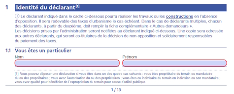


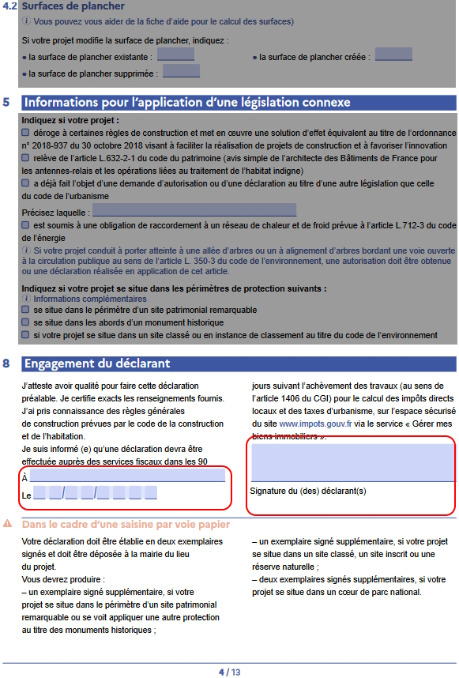


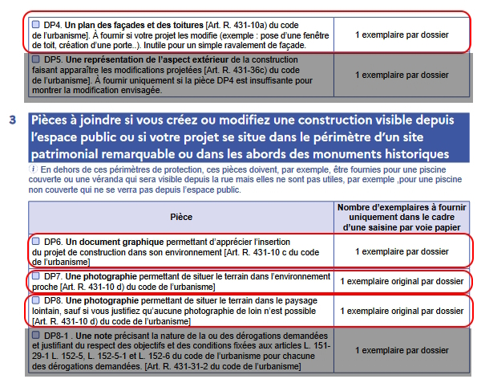


#### Annexe DP1<a name="Annexe%20DP1"></a>

Grâce au site [du cadastre](https://cadastre.data.gouv.fr), nous pouvons afficher à l'échelle 1:2000 l'habitation dans son environnement avec le numéro de la parcelle et une rose des vents.


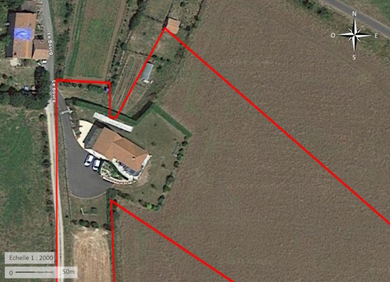

#### Annexe DP4<a name="Annexe%20DP4"></a>


#### Annexe DP6<a name="Annexe%20DP6"></a>

Pour cet annexe, il faudra prendre l'habitation en photo et faire un montage pour permettre de visualiser le rendu final, lorsque les panneaux solaires seront installés.

#### Annexe DP7<a name="Annexe%20DP7"></a>

Pour cet annexe, il faut prendre l'habitation en photo à 2-3 mètres du terrain et faire un montage pour permettre de visualiser le rendu final, lorsque les panneaux solaires seront installés

#### Annexe DP8<a name="Annexe%20DP8"></a>

Pour cette annexe, il faut prendre l'habitation en photo depuis un point éloigné, par exemple au bout de la rue et faire un montage pour permettre de visualiser le rendu final, lorsque les panneaux solaires seront installés

### Calcul de section et protection nécessaire<a name="Calcul%20de%20section%20et%20protection%20n%C3%A9cessaire"></a>

Maintenant que nous savons où installer nos panneaux solaires, il est nécessaire de déterminer la section de câble qu'il doit être utilisé entre le tableau électrique
et les panneaux solaires.

Cela se fait au moyen de la formule suivante :
```
NB_PHASE: Nombre de phase
P_S_ONDULEUR: Puissance maximum en sortie onduleur (VA)
PCT_PERTE: 1% (NF C-15 100 tolère 3% maximum)
DISTANCE: Distance en mètre entre le tableau de raccordement et les panneaux solaires

Résistivité_Cuivre: voir tableau

Intensité = P_S_ONDULEUR / (230 * NB_PHASE)
Section_par_conducteur = (DISTANCE * R_Résistivité_Cuivre * Intensité) / (PCT_PERTE * 230)
```

| Section    |    2.5 |      4 |      6 |     10 |     16 |     25 |     35 |     50 |     70 |
|------------|--------|--------|--------|--------|--------|--------|--------|--------|--------|
| Résistance | 0.0205 | 0.0204 | 0.0203 | 0.0191 | 0.0198 | 0.0199 | 0.0198 | 0.0197 | 0.0194 |


En triphasé, on prend directement la valeur Section_par_conducteur.

En monophasé, on prend la valeur Section_par_conducteur * 2.

Nous sommes en monophasé, avec 5 mètres de câble entre le tableau électrique et les panneaux solaires. Nous avons 6 panneaux solaires, donc 6 micro-onduleurs.
Cela nous donne :

```
NB_PHASE: 1
P_S_ONDULEUR: 325 * 6 (car 6 onduleurs)
PCT_PERTE: 1%
DISTANCE: 5

Intensité = 325*6 / (230 * 1) => 8.47
Section_par_conducteur = (5 * 0.0205 * 8.47) / (0.01 * 230)
```

La section par conducteur est de 0.37mm², que nous multiplions par 2. Toutefois, la NF C-15 100 impose une section minimum de 1.5mm².
Les onduleurs sont livrés avec des câbles de 2.5mm², nous allons garder cette section et mettre un disjoncteur de 10A.

Le câble allant vers les panneaux solaires doit aussi être protégé contre les fuites de courant. Pour cela, il faut installer un interrupteur différentiel 30mA.
Du fait que le courant circulant entre les panneaux solaires et le tableau soit alternatif et qu'il n'y a pas de consommation de courant à composante continue, un type AC est suffisant.

### Remplir la demande Consuel<a name="Remplir%20la%20demande%20Consuel"></a>

Puisque vous réalisez vous même l'installation des panneaux photovoltaïque et que pour cela, il est nécessaire de modifier l'installation électrique de l'habitation, vous devez faire valider l'installation par le Consuel, seul organisme agréé par l'État pour cette tâche.

Cela vous sera facturé environ 200€ (en 2024).

Une fois l'installation photovoltaïque réalisée, rendez-vous sur le site du [Consuel](https://www.consuel.com), créez-vous un compte et demandez une attestation **Installation de production d’énergie électrique sans dispositif de stockage** (Attestation de Conformité _Bleue_ (CERFA n°15523*01))

Voici comment procéder.
Acheter d'abord une attestation bleue :

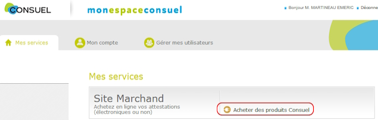


Remarquez en haut, vous avez le nombre d'attestation que vous avez acheté et de quel type.

Vous devrez indiquer où se situe votre chantier.
Indiquez vos coordonnées.

Il faudra ensuite fournir le schéma électrique de l'installation photovoltaïque ainsi que le dossier technique.
Dans notre cas d'étude, nous allons remplir le formulaire SC144C2-1 qui est spécifique à la pose de micro-onduleur.

Voici comment le remplir :


Il faut joindre à ce dossier, le schéma technique.
Voici un exemple :


J'ai pris un schéma pour des micro-onduleurs IQ8 de la marque Enphase.
Notez que les deux éléments : _Relay Q_ et _Passerelle Envoy_ sont propres à cette marque.
Il se peut que ces éléments ne soient pas présent dans votre installation.

Il faut aussi bien noter la présence du fil de terre qui relie le chassis des panneaux photovoltaïques ainsi que
les éléments métalliques (rails) sur lesquels les panneaux photovoltaïques sont posés.
Cet élément est obligatoire car la foudre pourrait toucher les panneaux ou la structure.
Il est aussi conseillé (ou obligatoire suivant le département où se trouve l'installation) de mettre un parafoudre (ici il est dans le tableau principal).

Sur le plan, les éléments liés à la production d'électricité sont mis dans un tableau électrique séparé. 
Vous pouvez les mettre dans le tableau principal mais il faudra qu'il y ait une séparation marquée.
Au prix du boîtier électrique, le plus simple est de le mettre à côté du tableau général si vous avez la place.

La longueur des liaisons est indiquée sur le schéma permettant ainsi à la personne qui l'étudie de constater que la section entre les panneaux
photovoltaïques par rapport à la puissance est bonne et que le tableau de production électrique est à moins de 3 mètres du tableau principal
et ne nécessite donc pas l'ajout d'un interrupteur différentiel dans le tableau électrique principal.

Il faudra aussi fournir l'attestation EN 50549 (VFR2019) des micro-onduleurs à télécharger sur le site du fabricant.


Une fois tout rempli, sur le site, voici l'écran à remplir :


#### Étiquetage<a name="%C3%89tiquetage"></a>

Disjoncteur de branchement (le 500mA) :


Dans le tableau général :

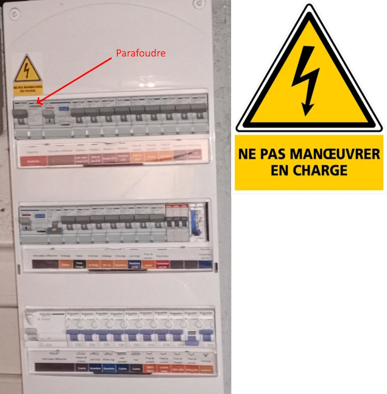

Dans le tableau de production électrique :


Notez le fait qu'il n'existe pas de planche d'autocolant pour les micro-onduleurs.
Vous devez utiliser les planches vendues pour les onduleurs centraux.

Le Consuel rapport que 36% des installations visitées en 2020 ont un défaut de signalisation !

### Remplir une demande CACSI (Convention d'Autoconsommation Sans Injection)<a name="Remplir%20une%20demande%20CACSI%20(Convention%20d'Autoconsommation%20Sans%20Injection)"></a>

Une fois votre installation terminée et validée par le Consuel, il vous faut signer une convention avec Enedis (ou votre gestionnaire local).
Dans le cas d'Enedis, rendez-vous sur le [portail de raccordement](https://connect-racco.enedis.fr) et créez-vous un compte.


Indiquez le commune où se trouve l'habitation.


Ensuite complétez tous les éléments :


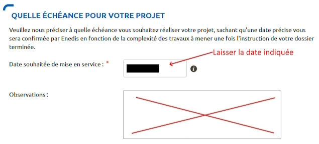


Maintenant renseignez l'installation :

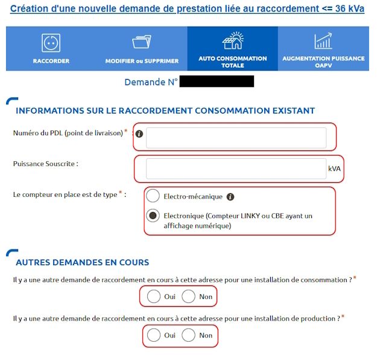


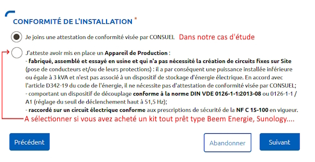

**Puissance installée de production** : dans notre cas d'étude les panneaux solaires ont une puissance crête supérieure aux micro-onduleurs.
Dans ce cas, c'est la somme des puissances de sortie des onduleurs.
Dans le cas contraire, c'est la somme des puissances des panneaux photovoltaïques.

**Puissance crête** : somme des puissances crêtes des panneaux photovoltaïques.

**Surface totale des panneaux** : somme de la surface des panneaux photovoltaïques.
Vous aussi vous vous demandez à quoi ça peut bien leur servir ?

**Protection de découpage** : dans le cas des micro-onduleurs, il faut toujours cocher **Intégrée aux onduleurs conformes DIN VDE 0126-1-1** y compris pour Enphase qui a un module externe.

Enfin, joignez tous les documents nécessaires :


Par expérience, joignez tous les documents demandés.
Même si certains sont facultatifs, ils vous seront demandés par Enedis.

Dans la partie autres documents, joignez l'attestation EN 50549 (VFR2019) car sinon elle vous sera demandée par Enedis.
Vous vous dites que c'est étrange puisque cette attestation est obligatoire pour l'attestation Consuel.
Attestation Consuel qui est obligatoire pour faire la demande de CACSI...

## Consommation du surplus de production<a name="Consommation%20du%20surplus%20de%20production"></a>

Comme évoqué dans la section **Mon installation solaire par un professionnel**, d'autres entreprises proposent des produits qui permettent de consommer le surplus d'électricité.
Ces solutions sont moins chers que Fronius et MyEnergi.

Veillez à bien à vérifier la conformité de ce type de matériel avec la réglementation électrique (perturbation électrique...).

Des projets sur internet proposent de faire la même chose à un prix encore plus bas.

# Entretenir ses panneaux-solaires<a name="Entretenir%20ses%20panneaux-solaires"></a>

Les panneaux solaires fonctionnant avec la luminosité du soleil,
tout ce qui réduit cette luminosité doit être évité.

L'ombre paraît évident, nous en avons déjà parlé, mais la saleté, les épines de pins, les pétales de fleurs, la mousse, le sable du Sahara...
Tout ce qui peut se fixer aux panneaux solaires et réduire l'ensoleillement va devoir faire l'objet d'une attention particulière.

Il est donc conseillé de nettoyer régulièrement ses panneaux solaires.
La fréquence dépendra de l'emplacement et de la saleté.

Il faut bien calculer la fréquence de nettoyage.
Si vous avez une maison à deux étages et que les panneaux sont sur le toit de la maison, il sera préférable de faire le nettoyage par quelqu'un qui a le matériel et les compétences pour monter sur un toit si haut.

Ce nettoyage aura un coût.
Si les panneaux solaires se salissent peu, il faut attendre que la baisse de rendement atteigne le coût de la prestation pour équilibrer le budget.
En général, une à deux fois par an est suffisant.

Si vous effectuez le nettoyage par vous même, utilisez de l'eau (si la saleté reste, ajoutez un peu de liquide vaisselle).
L'eau du robinet en séchant va laisser des traces.
Soit il faut utiliser de l'eau déminéralisée (mais suivant le nombre de panneaux, le coût devient significatif), soit de l'eau de pluie, soit essuyer l'eau avec un chiffon doux ou micro fibre.

Faîtes attention à éviter de nettoyer la surface des panneaux avec des brosses ou tout ce qui pourrait rayer le verre du panneau solaire.
Les rayures vont changer l'angle d'arrivée sur les cellules photo-électrique et vous perdrez un peu en rendement.

